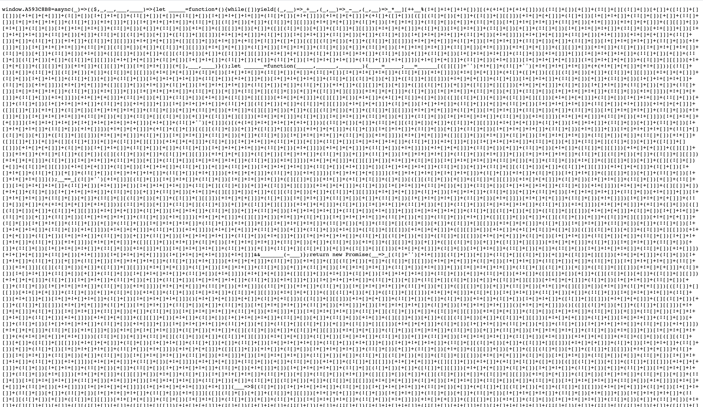
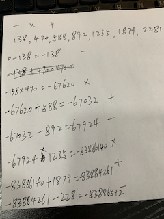
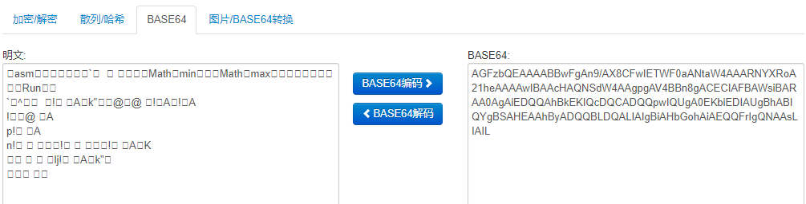
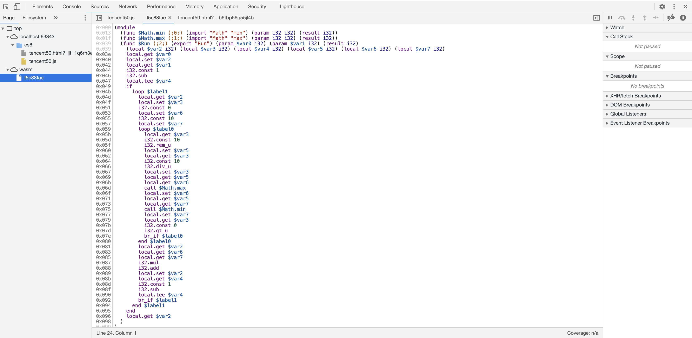

# 故事背景

​    上周五，偶然在公众号上看到，腾讯正在组织公开的技术活动，腾讯极客技术挑战赛第三期-码上种树（http://geek.qq.com/tree/）。作为一颗不甘寂寞的码农，毅然决定献上自己宝贵的秀发。(原文本来是发在infoq，结果一保存，一个字都没有了。算了，还是github靠谱)

# 规则简述

​    具体规则可查看上面的url，这里只做简述。


​    页面底部，有一个种树的button。点击后，会触发两次请求。1.GET方式请求：http://159.75.70.9:8081/pull?u=00000381B7452E9190E5205246B04AA7，获取json结果。

```json
{"c":"CA1807EB","a":[1846443],"t":"00000381010000010CC4CAD5C2C6DA39"}
```

2.得到结果后，发起第二次请求。http://159.75.70.9:8081/push?t=xxxx&a=xxxxxx。

返回结果：`{"success":1,"score":1}`

​    到现在，几个参数就明确了。u是当前用户的token，c是当前题目的js文件名，a是题面，t是当前请求的标记。题目就是把第一个接口返回的a，传入对应的js文件中，得到结果。拼接到第二接口中返回。这里边其实还有一个关键点，大家注意规则中1秒福利的描述。我猜测，应该会有算法优化的内容，需要将时间复杂度、空间复杂度优化的足够好，才能真正解题。

​    下面，让我们开始吧。

# 第一题

​    参数：

````json
{"c":"CA1807EB","a":[1846443],"t":"00000381010000010CC4CAD5C2C6DA39"}
````

```javascript
window.A274075A=async function({a}){return new Promise(_=>setTimeout(__=>_(a[0]),2000))}
```

​    这道题不用多说了吧，只需要把数组中a[0]取出来，传入第二个接口即可。答案懒得贴了，请大家自行脑补。

# 第二题

​    参数：

````json
{"c":"CA1807EB","a":[1846443,1846443,1846443],"t":"00000381010000010CC4CAD5C2C6DA39"}
````

​    第二题，题丢掉了。。。其实也和第一题类似，就是把a数组中的元素取出来，加一加，乘一乘。传入第二个接口即可。

​    直接贴答案。

````java
public static void main(String[] args) throws Exception {
    while (true) {
        String request1 = HttpUtil.getRequest("http://159.75.70.9:8081/pull?u=xxxx");
        Param1 result1 = JsonUtil.fromJsonString(request1, Param1.class);
        BigDecimal requestA = new BigDecimal(result1.getA().get(0));
        BigDecimal requestB = requestA.multiply(requestA).add(requestA);
        String requestUrl = "http://159.75.70.9:8081/push?t="+result1.getT()+"&a="+requestB;
        System.out.println(requestUrl);
        String request2 = HttpUtil.getRequest(requestUrl);
        System.out.println(request2);
    }
}
````

# 第三题

​    参数：

````json
{\"c\":\"A5473788\",\"a\":[247,471,130809],\"t\":\"00000381001000129EBADB52B246B486\"}
````

````javascript
eval(atob("dmFyIF8weGU5MzY9WydBNTQ3Mzc4OCddOyhmdW5jdGlvbihfMHg0OGU4NWMsXzB4ZTkzNmQ4KXt2YXIgXzB4MjNmYzVhPWZ1bmN0aW9uKF8weDI4NThkOSl7d2hpbGUoLS1fMHgyODU4ZDkpe18weDQ4ZTg1Y1sncHVzaCddKF8weDQ4ZTg1Y1snc2hpZnQnXSgpKTt9fTtfMHgyM2ZjNWEoKytfMHhlOTM2ZDgpO30oXzB4ZTkzNiwweDE5NikpO3ZhciBfMHgyM2ZjPWZ1bmN0aW9uKF8weDQ4ZTg1YyxfMHhlOTM2ZDgpe18weDQ4ZTg1Yz1fMHg0OGU4NWMtMHgwO3ZhciBfMHgyM2ZjNWE9XzB4ZTkzNltfMHg0OGU4NWNdO3JldHVybiBfMHgyM2ZjNWE7fTt3aW5kb3dbXzB4MjNmYygnMHgwJyldPWZ1bmN0aW9uKF8weDMzNTQzNyl7dmFyIF8weDFhYWMwMj0weDMwZDNmO2Zvcih2YXIgXzB4M2JlZDZhPTB4MzBkM2Y7XzB4M2JlZDZhPjB4MDtfMHgzYmVkNmEtLSl7dmFyIF8weDM3NTM0MD0weDA7Zm9yKHZhciBfMHgxZGRiNzc9MHgwO18weDFkZGI3NzxfMHgzYmVkNmE7XzB4MWRkYjc3Kyspe18weDM3NTM0MCs9XzB4MzM1NDM3WydhJ11bMHgwXTt9XzB4Mzc1MzQwJV8weDMzNTQzN1snYSddWzB4Ml09PV8weDMzNTQzN1snYSddWzB4MV0mJl8weDNiZWQ2YTxfMHgxYWFjMDImJihfMHgxYWFjMDI9XzB4M2JlZDZhKTt9cmV0dXJuIF8weDFhYWMwMjt9Ow=="))
````

看来前两道都是热身呀，第三道题开始上道了。

​    首先，明显可以看出，这是给出了一个base64字符串，那么我们先用工具解码，看一下这里边到底有什么东西。

````javascript
var _0xe936 = ['A5473788']; (function(_0x48e85c, _0xe936d8) {
    var _0x23fc5a = function(_0x2858d9) {
        while (--_0x2858d9) {
            _0x48e85c['push'](_0x48e85c['shift']());
        }
    };
    _0x23fc5a(++_0xe936d8);
} (_0xe936, 0x196));
var _0x23fc = function(_0x48e85c, _0xe936d8) {
    _0x48e85c = _0x48e85c - 0x0;
    var _0x23fc5a = _0xe936[_0x48e85c];
    return _0x23fc5a;
};
window[_0x23fc('0x0')] = function(_0x335437) {
    var _0x1aac02 = 0x30d3f;
    for (var _0x3bed6a = 0x30d3f; _0x3bed6a > 0x0; _0x3bed6a--) {
        var _0x375340 = 0x0;
        for (var _0x1ddb77 = 0x0; _0x1ddb77 < _0x3bed6a; _0x1ddb77++) {
            _0x375340 += _0x335437['a'][0x0];
        }
        _0x375340 % _0x335437['a'][0x2] == _0x335437['a'][0x1] && _0x3bed6a < _0x1aac02 && (_0x1aac02 = _0x3bed6a);
    }
    return _0x1aac02;
};
````

​    额。。。这个。。。原谅我一个小后端，第一次知道，这个样子的js代码，也能在浏览器里运行呀。上边的代码，可以明显的看出，函数中的变量及常量，都是用了16进制表示。也就是代码混淆。那么，首先，把简单的部分，如：0x0，0x2，0x1，0x30d3f还原。然后呢，剩下的，还是一堆乱七八糟的东西。别慌，这里需要你找一个好用一些的编辑器，把代码复制进去，把相同的变量，直接做替换，转为可读，易读的程序。这里我直接贴出我转换后的结果。

````javascript
function getA(param6) {
        var param7 = 199999;
        for (var param8 = 199999; param8 > 0; param8--) {
            var param9 = 0;
            param9 = param6[0]*param8;
            param9 % param6[2] == param6[1] && param8 < param7 && (param7 = param8);
        }
        return param7;
    };
````

​    根据转换结果，大家可以看出，混淆代码中，上边两个函数，完全没有用。他们是来打酱油的，为了增加我们转换的难度，打乱思路。也是为了增加代码的执行时间，防止你直接使用未经转换的js代码，直接跑接口，触发1秒的种树福利。所以，我就直接把上面的两个函数去掉了。这道题难度其实，还好。只需要你认真细心，把变量做替换即可。这里提一个小技巧，每次转换一个变量，一定要把参数输入进去跑一下，看看输出结果还是否正确，没有问题的话，再继续。这也是反混淆一个很好用的小技巧。

​    下边是我完整的解题代码。

````javascript
const request = require('sync-request');
while (true) {
    const res = request('GET', "http://159.75.70.9:8081/pull?u=");
    const result1 = res.getBody("utf-8");
    const result2 = JSON.parse(result1);

    const t = result2.t;
    const a = getA(result2.a);
    const res2 = request('GET', "http://159.75.70.9:8081/push?t=" + t + "&a=" + a);
    const result3 = res2.getBody("utf-8");
    console.log(result3);

    function getA(param6) {
        var param7 = 199999;
        for (var param8 = 199999; param8 > 0; param8--) {
            var param9 = 0;
            param9 = param6[0]*param8;
            param9 % param6[2] == param6[1] && param8 < param7 && (param7 = param8);
        }
        return param7;
    };
}
````

# 第四题

​    参数：

````json
{\"c\":\"A593C8B8\",\"a\":[138,892,490,1879,1235,588,2281],\"t\":\"0000038100250001E2F75EB23F088E6B\"}
````

````javascript
window.A593C8B8=async(_)=>(($,_,__,___,____)=>{let _____=function*(){while([])yield[(_,__)=>_+__,(_,__)=>_-__,(_,__)=>_*__][++__%(!+[]+!+[]+!+[])][(+(+!+[]+[+!+[]]))[(!![]+[])[+[]]+(!![]+[][(![]+[])[+[]]+([![]]+[][[]])[+!+[]+[+[]]]+(![]+[])[!+[]+!+[]]+(!![]+[])[+[]]+(!![]+[])[!+[]+!+[]+!+[]]+(!![]+[])[+!+[]]])[+!+[]+[+[]]]+(+![]+([]+[])[([][(![]+[])[+[]]+([![]]+[][[]])[+!+[]+[+[]]]+(![]+[])[!+[]+!+[]]+(!![]+[])[+[]]+(!![]+[])[!+[]+!+[]+!+[]]+(!![]+[])[+!+[]]]+[])[!+[]+!+[]+!+[]]+(!![]+[][(![]+[])[+[]]+([![]]+[][[]])[+!+[]+[+[]]]+(![]+[])[!+[]+!+[]]+(!![]+[])[+[]]+(!![]+[])[!+[]+!+[]+!+[]]+(!![]+[])[+!+[]]])[+!+[]+[+[]]]+([][[]]+[])[+!+[]]+(![]+[])[!+[]+!+[]+!+[]]+(!![]+[])[+[]]+(!![]+[])[+!+[]]+([][[]]+[])[+[]]+([][(![]+[])[+[]]+([![]]+[][[]])[+!+[]+[+[]]]+(![]+[])[!+[]+!+[]]+(!![]+[])[+[]]+(!![]+[])[!+[]+!+[]+!+[]]+(!![]+[])[+!+[]]]+[])[!+[]+!+[]+!+[]]+(!![]+[])[+[]]+(!![]+[][(![]+[])[+[]]+([![]]+[][[]])[+!+[]+[+[]]]+(![]+[])[!+[]+!+[]]+(!![]+[])[+[]]+(!![]+[])[!+[]+!+[]+!+[]]+(!![]+[])[+!+[]]])[+!+[]+[+[]]]+(!![]+[])[+!+[]]])[+!+[]+[+[]]]+(!![]+[])[+[]]+(!![]+[])[+!+[]]+([![]]+[][[]])[+!+[]+[+[]]]+([][[]]+[])[+!+[]]+(+![]+[![]]+([]+[])[([][(![]+[])[+[]]+([![]]+[][[]])[+!+[]+[+[]]]+(![]+[])[!+[]+!+[]]+(!![]+[])[+[]]+(!![]+[])[!+[]+!+[]+!+[]]+(!![]+[])[+!+[]]]+[])[!+[]+!+[]+!+[]]+(!![]+[][(![]+[])[+[]]+([![]]+[][[]])[+!+[]+[+[]]]+(![]+[])[!+[]+!+[]]+(!![]+[])[+[]]+(!![]+[])[!+[]+!+[]+!+[]]+(!![]+[])[+!+[]]])[+!+[]+[+[]]]+([][[]]+[])[+!+[]]+(![]+[])[!+[]+!+[]+!+[]]+(!![]+[])[+[]]+(!![]+[])[+!+[]]+([][[]]+[])[+[]]+([][(![]+[])[+[]]+([![]]+[][[]])[+!+[]+[+[]]]+(![]+[])[!+[]+!+[]]+(!![]+[])[+[]]+(!![]+[])[!+[]+!+[]+!+[]]+(!![]+[])[+!+[]]]+[])[!+[]+!+[]+!+[]]+(!![]+[])[+[]]+(!![]+[][(![]+[])[+[]]+([![]]+[][[]])[+!+[]+[+[]]]+(![]+[])[!+[]+!+[]]+(!![]+[])[+[]]+(!![]+[])[!+[]+!+[]+!+[]]+(!![]+[])[+!+[]]])[+!+[]+[+[]]]+(!![]+[])[+!+[]]])[!+[]+!+[]+[+[]]]](!+[]+!+[]+[+[]])+([![]]+[][[]])[+!+[]+[+[]]]+([][[]]+[])[+!+[]]+([][[]]+[])[!+[]+!+[]]](+[],___,____)}();let ______=function(_____,______,_______){____=_____;___=______[([][[]]+'')[+!+[]]+(!![]+'')[+!+[]+!+[]+!+[]]+(+(+!+[]+[+[]]+[+!+[]]))[(!![]+[])[+[]]+(!![]+[][(![]+[])[+[]]+([![]]+[][[]])[+!+[]+[+[]]]+(![]+[])[!+[]+!+[]]+(!![]+[])[+[]]+(!![]+[])[!+[]+!+[]+!+[]]+(!![]+[])[+!+[]]])[+!+[]+[+[]]]+(+![]+([]+[])[([][(![]+[])[+[]]+([![]]+[][[]])[+!+[]+[+[]]]+(![]+[])[!+[]+!+[]]+(!![]+[])[+[]]+(!![]+[])[!+[]+!+[]+!+[]]+(!![]+[])[+!+[]]]+[])[!+[]+!+[]+!+[]]+(!![]+[][(![]+[])[+[]]+([![]]+[][[]])[+!+[]+[+[]]]+(![]+[])[!+[]+!+[]]+(!![]+[])[+[]]+(!![]+[])[!+[]+!+[]+!+[]]+(!![]+[])[+!+[]]])[+!+[]+[+[]]]+([][[]]+[])[+!+[]]+(![]+[])[!+[]+!+[]+!+[]]+(!![]+[])[+[]]+(!![]+[])[+!+[]]+([][[]]+[])[+[]]+([][(![]+[])[+[]]+([![]]+[][[]])[+!+[]+[+[]]]+(![]+[])[!+[]+!+[]]+(!![]+[])[+[]]+(!![]+[])[!+[]+!+[]+!+[]]+(!![]+[])[+!+[]]]+[])[!+[]+!+[]+!+[]]+(!![]+[])[+[]]+(!![]+[][(![]+[])[+[]]+([![]]+[][[]])[+!+[]+[+[]]]+(![]+[])[!+[]+!+[]]+(!![]+[])[+[]]+(!![]+[])[!+[]+!+[]+!+[]]+(!![]+[])[+!+[]]])[+!+[]+[+[]]]+(!![]+[])[+!+[]]])[+!+[]+[+[]]]+(!![]+[])[+[]]+(!![]+[])[+!+[]]+([![]]+[][[]])[+!+[]+[+[]]]+([][[]]+[])[+!+[]]+(+![]+[![]]+([]+[])[([][(![]+[])[+[]]+([![]]+[][[]])[+!+[]+[+[]]]+(![]+[])[!+[]+!+[]]+(!![]+[])[+[]]+(!![]+[])[!+[]+!+[]+!+[]]+(!![]+[])[+!+[]]]+[])[!+[]+!+[]+!+[]]+(!![]+[][(![]+[])[+[]]+([![]]+[][[]])[+!+[]+[+[]]]+(![]+[])[!+[]+!+[]]+(!![]+[])[+[]]+(!![]+[])[!+[]+!+[]+!+[]]+(!![]+[])[+!+[]]])[+!+[]+[+[]]]+([][[]]+[])[+!+[]]+(![]+[])[!+[]+!+[]+!+[]]+(!![]+[])[+[]]+(!![]+[])[+!+[]]+([][[]]+[])[+[]]+([][(![]+[])[+[]]+([![]]+[][[]])[+!+[]+[+[]]]+(![]+[])[!+[]+!+[]]+(!![]+[])[+[]]+(!![]+[])[!+[]+!+[]+!+[]]+(!![]+[])[+!+[]]]+[])[!+[]+!+[]+!+[]]+(!![]+[])[+[]]+(!![]+[][(![]+[])[+[]]+([![]]+[][[]])[+!+[]+[+[]]]+(![]+[])[!+[]+!+[]]+(!![]+[])[+[]]+(!![]+[])[!+[]+!+[]+!+[]]+(!![]+[])[+!+[]]])[+!+[]+[+[]]]+(!![]+[])[+!+[]]])[!+[]+!+[]+[+[]]]](!+[]+!+[]+!+[]+[!+[]+!+[]+!+[]+!+[]])[+!+[]]+(!![]+'')[+[]]]()[(+(!+[]+!+[]+!+[]+[+!+[]]))[(!![]+[])[+[]]+(!![]+[][(![]+[])[+[]]+([![]]+[][[]])[+!+[]+[+[]]]+(![]+[])[!+[]+!+[]]+(!![]+[])[+[]]+(!![]+[])[!+[]+!+[]+!+[]]+(!![]+[])[+!+[]]])[+!+[]+[+[]]]+(+![]+([]+[])[([][(![]+[])[+[]]+([![]]+[][[]])[+!+[]+[+[]]]+(![]+[])[!+[]+!+[]]+(!![]+[])[+[]]+(!![]+[])[!+[]+!+[]+!+[]]+(!![]+[])[+!+[]]]+[])[!+[]+!+[]+!+[]]+(!![]+[][(![]+[])[+[]]+([![]]+[][[]])[+!+[]+[+[]]]+(![]+[])[!+[]+!+[]]+(!![]+[])[+[]]+(!![]+[])[!+[]+!+[]+!+[]]+(!![]+[])[+!+[]]])[+!+[]+[+[]]]+([][[]]+[])[+!+[]]+(![]+[])[!+[]+!+[]+!+[]]+(!![]+[])[+[]]+(!![]+[])[+!+[]]+([][[]]+[])[+[]]+([][(![]+[])[+[]]+([![]]+[][[]])[+!+[]+[+[]]]+(![]+[])[!+[]+!+[]]+(!![]+[])[+[]]+(!![]+[])[!+[]+!+[]+!+[]]+(!![]+[])[+!+[]]]+[])[!+[]+!+[]+!+[]]+(!![]+[])[+[]]+(!![]+[][(![]+[])[+[]]+([![]]+[][[]])[+!+[]+[+[]]]+(![]+[])[!+[]+!+[]]+(!![]+[])[+[]]+(!![]+[])[!+[]+!+[]+!+[]]+(!![]+[])[+!+[]]])[+!+[]+[+[]]]+(!![]+[])[+!+[]]])[+!+[]+[+[]]]+(!![]+[])[+[]]+(!![]+[])[+!+[]]+([![]]+[][[]])[+!+[]+[+[]]]+([][[]]+[])[+!+[]]+(+![]+[![]]+([]+[])[([][(![]+[])[+[]]+([![]]+[][[]])[+!+[]+[+[]]]+(![]+[])[!+[]+!+[]]+(!![]+[])[+[]]+(!![]+[])[!+[]+!+[]+!+[]]+(!![]+[])[+!+[]]]+[])[!+[]+!+[]+!+[]]+(!![]+[][(![]+[])[+[]]+([![]]+[][[]])[+!+[]+[+[]]]+(![]+[])[!+[]+!+[]]+(!![]+[])[+[]]+(!![]+[])[!+[]+!+[]+!+[]]+(!![]+[])[+!+[]]])[+!+[]+[+[]]]+([][[]]+[])[+!+[]]+(![]+[])[!+[]+!+[]+!+[]]+(!![]+[])[+[]]+(!![]+[])[+!+[]]+([][[]]+[])[+[]]+([][(![]+[])[+[]]+([![]]+[][[]])[+!+[]+[+[]]]+(![]+[])[!+[]+!+[]]+(!![]+[])[+[]]+(!![]+[])[!+[]+!+[]+!+[]]+(!![]+[])[+!+[]]]+[])[!+[]+!+[]+!+[]]+(!![]+[])[+[]]+(!![]+[][(![]+[])[+[]]+([![]]+[][[]])[+!+[]+[+[]]]+(![]+[])[!+[]+!+[]]+(!![]+[])[+[]]+(!![]+[])[!+[]+!+[]+!+[]]+(!![]+[])[+!+[]]])[+!+[]+[+[]]]+(!![]+[])[+!+[]]])[!+[]+!+[]+[+[]]]](!+[]+!+[]+!+[]+[!+[]+!+[]])+(![]+[])[+!+[]]+(![]+[])[!+[]+!+[]]+([][[]]+[])[+[]]+(!![]+[])[!+[]+!+[]+!+[]]]();__==_[(![]+'')[+!+[]]][(![]+[])[!+[]+!+[]]+(!![]+[])[!+[]+!+[]+!+[]]+([][[]]+[])[+!+[]]+(+![]+[![]]+([]+[])[([][(![]+[])[+[]]+([![]]+[][[]])[+!+[]+[+[]]]+(![]+[])[!+[]+!+[]]+(!![]+[])[+[]]+(!![]+[])[!+[]+!+[]+!+[]]+(!![]+[])[+!+[]]]+[])[!+[]+!+[]+!+[]]+(!![]+[][(![]+[])[+[]]+([![]]+[][[]])[+!+[]+[+[]]]+(![]+[])[!+[]+!+[]]+(!![]+[])[+[]]+(!![]+[])[!+[]+!+[]+!+[]]+(!![]+[])[+!+[]]])[+!+[]+[+[]]]+([][[]]+[])[+!+[]]+(![]+[])[!+[]+!+[]+!+[]]+(!![]+[])[+[]]+(!![]+[])[+!+[]]+([][[]]+[])[+[]]+([][(![]+[])[+[]]+([![]]+[][[]])[+!+[]+[+[]]]+(![]+[])[!+[]+!+[]]+(!![]+[])[+[]]+(!![]+[])[!+[]+!+[]+!+[]]+(!![]+[])[+!+[]]]+[])[!+[]+!+[]+!+[]]+(!![]+[])[+[]]+(!![]+[][(![]+[])[+[]]+([![]]+[][[]])[+!+[]+[+[]]]+(![]+[])[!+[]+!+[]]+(!![]+[])[+[]]+(!![]+[])[!+[]+!+[]+!+[]]+(!![]+[])[+!+[]]])[+!+[]+[+[]]]+(!![]+[])[+!+[]]])[!+[]+!+[]+[+[]]]+(!![]+[])[+[]]+(+(+!+[]+[+[]]+[+!+[]]))[(!![]+[])[+[]]+(!![]+[][(![]+[])[+[]]+([![]]+[][[]])[+!+[]+[+[]]]+(![]+[])[!+[]+!+[]]+(!![]+[])[+[]]+(!![]+[])[!+[]+!+[]+!+[]]+(!![]+[])[+!+[]]])[+!+[]+[+[]]]+(+![]+([]+[])[([][(![]+[])[+[]]+([![]]+[][[]])[+!+[]+[+[]]]+(![]+[])[!+[]+!+[]]+(!![]+[])[+[]]+(!![]+[])[!+[]+!+[]+!+[]]+(!![]+[])[+!+[]]]+[])[!+[]+!+[]+!+[]]+(!![]+[][(![]+[])[+[]]+([![]]+[][[]])[+!+[]+[+[]]]+(![]+[])[!+[]+!+[]]+(!![]+[])[+[]]+(!![]+[])[!+[]+!+[]+!+[]]+(!![]+[])[+!+[]]])[+!+[]+[+[]]]+([][[]]+[])[+!+[]]+(![]+[])[!+[]+!+[]+!+[]]+(!![]+[])[+[]]+(!![]+[])[+!+[]]+([][[]]+[])[+[]]+([][(![]+[])[+[]]+([![]]+[][[]])[+!+[]+[+[]]]+(![]+[])[!+[]+!+[]]+(!![]+[])[+[]]+(!![]+[])[!+[]+!+[]+!+[]]+(!![]+[])[+!+[]]]+[])[!+[]+!+[]+!+[]]+(!![]+[])[+[]]+(!![]+[][(![]+[])[+[]]+([![]]+[][[]])[+!+[]+[+[]]]+(![]+[])[!+[]+!+[]]+(!![]+[])[+[]]+(!![]+[])[!+[]+!+[]+!+[]]+(!![]+[])[+!+[]]])[+!+[]+[+[]]]+(!![]+[])[+!+[]]])[+!+[]+[+[]]]+(!![]+[])[+[]]+(!![]+[])[+!+[]]+([![]]+[][[]])[+!+[]+[+[]]]+([][[]]+[])[+!+[]]+(+![]+[![]]+([]+[])[([][(![]+[])[+[]]+([![]]+[][[]])[+!+[]+[+[]]]+(![]+[])[!+[]+!+[]]+(!![]+[])[+[]]+(!![]+[])[!+[]+!+[]+!+[]]+(!![]+[])[+!+[]]]+[])[!+[]+!+[]+!+[]]+(!![]+[][(![]+[])[+[]]+([![]]+[][[]])[+!+[]+[+[]]]+(![]+[])[!+[]+!+[]]+(!![]+[])[+[]]+(!![]+[])[!+[]+!+[]+!+[]]+(!![]+[])[+!+[]]])[+!+[]+[+[]]]+([][[]]+[])[+!+[]]+(![]+[])[!+[]+!+[]+!+[]]+(!![]+[])[+[]]+(!![]+[])[+!+[]]+([][[]]+[])[+[]]+([][(![]+[])[+[]]+([![]]+[][[]])[+!+[]+[+[]]]+(![]+[])[!+[]+!+[]]+(!![]+[])[+[]]+(!![]+[])[!+[]+!+[]+!+[]]+(!![]+[])[+!+[]]]+[])[!+[]+!+[]+!+[]]+(!![]+[])[+[]]+(!![]+[][(![]+[])[+[]]+([![]]+[][[]])[+!+[]+[+[]]]+(![]+[])[!+[]+!+[]]+(!![]+[])[+[]]+(!![]+[])[!+[]+!+[]+!+[]]+(!![]+[])[+!+[]]])[+!+[]+[+[]]]+(!![]+[])[+!+[]]])[!+[]+!+[]+[+[]]]](!+[]+!+[]+[+!+[]])[+!+[]]]&&_______(-___)};return new Promise(__=>_[(![]+'')[+!+[]]][(![]+[])[+[]]+(!![]+[][(![]+[])[+[]]+([![]]+[][[]])[+!+[]+[+[]]]+(![]+[])[!+[]+!+[]]+(!![]+[])[+[]]+(!![]+[])[!+[]+!+[]+!+[]]+(!![]+[])[+!+[]]])[+!+[]+[+[]]]+(!![]+[])[+!+[]]+([][(![]+[])[+[]]+([![]]+[][[]])[+!+[]+[+[]]]+(![]+[])[!+[]+!+[]]+(!![]+[])[+[]]+(!![]+[])[!+[]+!+[]+!+[]]+(!![]+[])[+!+[]]][([][(![]+[])[+[]]+([![]]+[][[]])[+!+[]+[+[]]]+(![]+[])[!+[]+!+[]]+(!![]+[])[+[]]+(!![]+[])[!+[]+!+[]+!+[]]+(!![]+[])[+!+[]]]+[])[!+[]+!+[]+!+[]]+(!![]+[][(![]+[])[+[]]+([![]]+[][[]])[+!+[]+[+[]]]+(![]+[])[!+[]+!+[]]+(!![]+[])[+[]]+(!![]+[])[!+[]+!+[]+!+[]]+(!![]+[])[+!+[]]])[+!+[]+[+[]]]+([][[]]+[])[+!+[]]+(![]+[])[!+[]+!+[]+!+[]]+(!![]+[])[+[]]+(!![]+[])[+!+[]]+([][[]]+[])[+[]]+([][(![]+[])[+[]]+([![]]+[][[]])[+!+[]+[+[]]]+(![]+[])[!+[]+!+[]]+(!![]+[])[+[]]+(!![]+[])[!+[]+!+[]+!+[]]+(!![]+[])[+!+[]]]+[])[!+[]+!+[]+!+[]]+(!![]+[])[+[]]+(!![]+[][(![]+[])[+[]]+([![]]+[][[]])[+!+[]+[+[]]]+(![]+[])[!+[]+!+[]]+(!![]+[])[+[]]+(!![]+[])[!+[]+!+[]+!+[]]+(!![]+[])[+!+[]]])[+!+[]+[+[]]]+(!![]+[])[+!+[]]]((!![]+[])[+!+[]]+(!![]+[])[!+[]+!+[]+!+[]]+(!![]+[])[+[]]+([][[]]+[])[+[]]+(!![]+[])[+!+[]]+([][[]]+[])[+!+[]]+(![]+[+![]])[([![]]+[][[]])[+!+[]+[+[]]]+(!![]+[])[+[]]+(![]+[])[+!+[]]+(![]+[])[!+[]+!+[]]+([![]]+[][[]])[+!+[]+[+[]]]+([][(![]+[])[+[]]+([![]]+[][[]])[+!+[]+[+[]]]+(![]+[])[!+[]+!+[]]+(!![]+[])[+[]]+(!![]+[])[!+[]+!+[]+!+[]]+(!![]+[])[+!+[]]]+[])[!+[]+!+[]+!+[]]+(![]+[])[!+[]+!+[]+!+[]]]()[+!+[]+[+[]]]+[+[]]+(![]+[+![]])[([![]]+[][[]])[+!+[]+[+[]]]+(!![]+[])[+[]]+(![]+[])[+!+[]]+(![]+[])[!+[]+!+[]]+([![]]+[][[]])[+!+[]+[+[]]]+([][(![]+[])[+[]]+([![]]+[][[]])[+!+[]+[+[]]]+(![]+[])[!+[]+!+[]]+(!![]+[])[+[]]+(!![]+[])[!+[]+!+[]+!+[]]+(!![]+[])[+!+[]]]+[])[!+[]+!+[]+!+[]]+(![]+[])[!+[]+!+[]+!+[]]]()[+!+[]+[+[]]])()[([][(![]+[])[+[]]+([![]]+[][[]])[+!+[]+[+[]]]+(![]+[])[!+[]+!+[]]+(!![]+[])[+[]]+(!![]+[])[!+[]+!+[]+!+[]]+(!![]+[])[+!+[]]]+[])[!+[]+!+[]+!+[]]+(!![]+[][(![]+[])[+[]]+([![]]+[][[]])[+!+[]+[+[]]]+(![]+[])[!+[]+!+[]]+(!![]+[])[+[]]+(!![]+[])[!+[]+!+[]+!+[]]+(!![]+[])[+!+[]]])[+!+[]+[+[]]]+([][[]]+[])[+!+[]]+(![]+[])[!+[]+!+[]+!+[]]+(!![]+[])[+[]]+(!![]+[])[+!+[]]+([][[]]+[])[+[]]+([][(![]+[])[+[]]+([![]]+[][[]])[+!+[]+[+[]]]+(![]+[])[!+[]+!+[]]+(!![]+[])[+[]]+(!![]+[])[!+[]+!+[]+!+[]]+(!![]+[])[+!+[]]]+[])[!+[]+!+[]+!+[]]+(!![]+[])[+[]]+(!![]+[][(![]+[])[+[]]+([![]]+[][[]])[+!+[]+[+[]]]+(![]+[])[!+[]+!+[]]+(!![]+[])[+[]]+(!![]+[])[!+[]+!+[]+!+[]]+(!![]+[])[+!+[]]])[+!+[]+[+[]]]+(!![]+[])[+!+[]]]+[])[+!+[]+[!+[]+!+[]]]+(![]+[])[+!+[]]+([][(![]+[])[+[]]+([![]]+[][[]])[+!+[]+[+[]]]+(![]+[])[!+[]+!+[]]+(!![]+[])[+[]]+(!![]+[])[!+[]+!+[]+!+[]]+(!![]+[])[+!+[]]]+[])[!+[]+!+[]+!+[]]+(+(+!+[]+[+[]]+[+!+[]]))[(!![]+[])[+[]]+(!![]+[][(![]+[])[+[]]+([![]]+[][[]])[+!+[]+[+[]]]+(![]+[])[!+[]+!+[]]+(!![]+[])[+[]]+(!![]+[])[!+[]+!+[]+!+[]]+(!![]+[])[+!+[]]])[+!+[]+[+[]]]+(+![]+([]+[])[([][(![]+[])[+[]]+([![]]+[][[]])[+!+[]+[+[]]]+(![]+[])[!+[]+!+[]]+(!![]+[])[+[]]+(!![]+[])[!+[]+!+[]+!+[]]+(!![]+[])[+!+[]]]+[])[!+[]+!+[]+!+[]]+(!![]+[][(![]+[])[+[]]+([![]]+[][[]])[+!+[]+[+[]]]+(![]+[])[!+[]+!+[]]+(!![]+[])[+[]]+(!![]+[])[!+[]+!+[]+!+[]]+(!![]+[])[+!+[]]])[+!+[]+[+[]]]+([][[]]+[])[+!+[]]+(![]+[])[!+[]+!+[]+!+[]]+(!![]+[])[+[]]+(!![]+[])[+!+[]]+([][[]]+[])[+[]]+([][(![]+[])[+[]]+([![]]+[][[]])[+!+[]+[+[]]]+(![]+[])[!+[]+!+[]]+(!![]+[])[+[]]+(!![]+[])[!+[]+!+[]+!+[]]+(!![]+[])[+!+[]]]+[])[!+[]+!+[]+!+[]]+(!![]+[])[+[]]+(!![]+[][(![]+[])[+[]]+([![]]+[][[]])[+!+[]+[+[]]]+(![]+[])[!+[]+!+[]]+(!![]+[])[+[]]+(!![]+[])[!+[]+!+[]+!+[]]+(!![]+[])[+!+[]]])[+!+[]+[+[]]]+(!![]+[])[+!+[]]])[+!+[]+[+[]]]+(!![]+[])[+[]]+(!![]+[])[+!+[]]+([![]]+[][[]])[+!+[]+[+[]]]+([][[]]+[])[+!+[]]+(+![]+[![]]+([]+[])[([][(![]+[])[+[]]+([![]]+[][[]])[+!+[]+[+[]]]+(![]+[])[!+[]+!+[]]+(!![]+[])[+[]]+(!![]+[])[!+[]+!+[]+!+[]]+(!![]+[])[+!+[]]]+[])[!+[]+!+[]+!+[]]+(!![]+[][(![]+[])[+[]]+([![]]+[][[]])[+!+[]+[+[]]]+(![]+[])[!+[]+!+[]]+(!![]+[])[+[]]+(!![]+[])[!+[]+!+[]+!+[]]+(!![]+[])[+!+[]]])[+!+[]+[+[]]]+([][[]]+[])[+!+[]]+(![]+[])[!+[]+!+[]+!+[]]+(!![]+[])[+[]]+(!![]+[])[+!+[]]+([][[]]+[])[+[]]+([][(![]+[])[+[]]+([![]]+[][[]])[+!+[]+[+[]]]+(![]+[])[!+[]+!+[]]+(!![]+[])[+[]]+(!![]+[])[!+[]+!+[]+!+[]]+(!![]+[])[+!+[]]]+[])[!+[]+!+[]+!+[]]+(!![]+[])[+[]]+(!![]+[][(![]+[])[+[]]+([![]]+[][[]])[+!+[]+[+[]]]+(![]+[])[!+[]+!+[]]+(!![]+[])[+[]]+(!![]+[])[!+[]+!+[]+!+[]]+(!![]+[])[+!+[]]])[+!+[]+[+[]]]+(!![]+[])[+!+[]]])[!+[]+!+[]+[+[]]]](!+[]+!+[]+[+!+[]])[+!+[]]](___=>$[(![]+[])[!+[]+!+[]+!+[]]+(!![]+[])[!+[]+!+[]+!+[]]+(!![]+[])[+[]]+(+[![]]+[][(![]+[])[+[]]+([![]]+[][[]])[+!+[]+[+[]]]+(![]+[])[!+[]+!+[]]+(!![]+[])[+[]]+(!![]+[])[!+[]+!+[]+!+[]]+(!![]+[])[+!+[]]][([][(![]+[])[+[]]+([![]]+[][[]])[+!+[]+[+[]]]+(![]+[])[!+[]+!+[]]+(!![]+[])[+[]]+(!![]+[])[!+[]+!+[]+!+[]]+(!![]+[])[+!+[]]]+[])[!+[]+!+[]+!+[]]+(!![]+[][(![]+[])[+[]]+([![]]+[][[]])[+!+[]+[+[]]]+(![]+[])[!+[]+!+[]]+(!![]+[])[+[]]+(!![]+[])[!+[]+!+[]+!+[]]+(!![]+[])[+!+[]]])[+!+[]+[+[]]]+([][[]]+[])[+!+[]]+(![]+[])[!+[]+!+[]+!+[]]+(!![]+[])[+[]]+(!![]+[])[+!+[]]+([][[]]+[])[+[]]+([][(![]+[])[+[]]+([![]]+[][[]])[+!+[]+[+[]]]+(![]+[])[!+[]+!+[]]+(!![]+[])[+[]]+(!![]+[])[!+[]+!+[]+!+[]]+(!![]+[])[+!+[]]]+[])[!+[]+!+[]+!+[]]+(!![]+[])[+[]]+(!![]+[][(![]+[])[+[]]+([![]]+[][[]])[+!+[]+[+[]]]+(![]+[])[!+[]+!+[]]+(!![]+[])[+[]]+(!![]+[])[!+[]+!+[]+!+[]]+(!![]+[])[+!+[]]])[+!+[]+[+[]]]+(!![]+[])[+!+[]]]((!![]+[])[+!+[]]+(!![]+[])[!+[]+!+[]+!+[]]+(!![]+[])[+[]]+([][[]]+[])[+[]]+(!![]+[])[+!+[]]+([][[]]+[])[+!+[]]+(+[![]]+[][(![]+[])[+[]]+([![]]+[][[]])[+!+[]+[+[]]]+(![]+[])[!+[]+!+[]]+(!![]+[])[+[]]+(!![]+[])[!+[]+!+[]+!+[]]+(!![]+[])[+!+[]]])[+!+[]+[+!+[]]]+[][(![]+[])[+[]]+([![]]+[][[]])[+!+[]+[+[]]]+(![]+[])[!+[]+!+[]]+(!![]+[])[+[]]+(!![]+[])[!+[]+!+[]+!+[]]+(!![]+[])[+!+[]]][([][(![]+[])[+[]]+([![]]+[][[]])[+!+[]+[+[]]]+(![]+[])[!+[]+!+[]]+(!![]+[])[+[]]+(!![]+[])[!+[]+!+[]+!+[]]+(!![]+[])[+!+[]]]+[])[!+[]+!+[]+!+[]]+(!![]+[][(![]+[])[+[]]+([![]]+[][[]])[+!+[]+[+[]]]+(![]+[])[!+[]+!+[]]+(!![]+[])[+[]]+(!![]+[])[!+[]+!+[]+!+[]]+(!![]+[])[+!+[]]])[+!+[]+[+[]]]+([][[]]+[])[+!+[]]+(![]+[])[!+[]+!+[]+!+[]]+(!![]+[])[+[]]+(!![]+[])[+!+[]]+([][[]]+[])[+[]]+([][(![]+[])[+[]]+([![]]+[][[]])[+!+[]+[+[]]]+(![]+[])[!+[]+!+[]]+(!![]+[])[+[]]+(!![]+[])[!+[]+!+[]+!+[]]+(!![]+[])[+!+[]]]+[])[!+[]+!+[]+!+[]]+(!![]+[])[+[]]+(!![]+[][(![]+[])[+[]]+([![]]+[][[]])[+!+[]+[+[]]]+(![]+[])[!+[]+!+[]]+(!![]+[])[+[]]+(!![]+[])[!+[]+!+[]+!+[]]+(!![]+[])[+!+[]]])[+!+[]+[+[]]]+(!![]+[])[+!+[]]]((!![]+[])[+!+[]]+(!![]+[])[!+[]+!+[]+!+[]]+(!![]+[])[+[]]+([][[]]+[])[+[]]+(!![]+[])[+!+[]]+([][[]]+[])[+!+[]]+(+[![]]+[][(![]+[])[+[]]+([![]]+[][[]])[+!+[]+[+[]]]+(![]+[])[!+[]+!+[]]+(!![]+[])[+[]]+(!![]+[])[!+[]+!+[]+!+[]]+(!![]+[])[+!+[]]])[+!+[]+[+!+[]]]+(!![]+[])[!+[]+!+[]+!+[]]+(![]+[])[!+[]+!+[]+!+[]]+([][(![]+[])[+[]]+([![]]+[][[]])[+!+[]+[+[]]]+(![]+[])[!+[]+!+[]]+(!![]+[])[+[]]+(!![]+[])[!+[]+!+[]+!+[]]+(!![]+[])[+!+[]]]+[])[!+[]+!+[]+!+[]]+(![]+[])[+!+[]]+(+(!+[]+!+[]+[+!+[]]+[+!+[]]))[(!![]+[])[+[]]+(!![]+[][(![]+[])[+[]]+([![]]+[][[]])[+!+[]+[+[]]]+(![]+[])[!+[]+!+[]]+(!![]+[])[+[]]+(!![]+[])[!+[]+!+[]+!+[]]+(!![]+[])[+!+[]]])[+!+[]+[+[]]]+(+![]+([]+[])[([][(![]+[])[+[]]+([![]]+[][[]])[+!+[]+[+[]]]+(![]+[])[!+[]+!+[]]+(!![]+[])[+[]]+(!![]+[])[!+[]+!+[]+!+[]]+(!![]+[])[+!+[]]]+[])[!+[]+!+[]+!+[]]+(!![]+[][(![]+[])[+[]]+([![]]+[][[]])[+!+[]+[+[]]]+(![]+[])[!+[]+!+[]]+(!![]+[])[+[]]+(!![]+[])[!+[]+!+[]+!+[]]+(!![]+[])[+!+[]]])[+!+[]+[+[]]]+([][[]]+[])[+!+[]]+(![]+[])[!+[]+!+[]+!+[]]+(!![]+[])[+[]]+(!![]+[])[+!+[]]+([][[]]+[])[+[]]+([][(![]+[])[+[]]+([![]]+[][[]])[+!+[]+[+[]]]+(![]+[])[!+[]+!+[]]+(!![]+[])[+[]]+(!![]+[])[!+[]+!+[]+!+[]]+(!![]+[])[+!+[]]]+[])[!+[]+!+[]+!+[]]+(!![]+[])[+[]]+(!![]+[][(![]+[])[+[]]+([![]]+[][[]])[+!+[]+[+[]]]+(![]+[])[!+[]+!+[]]+(!![]+[])[+[]]+(!![]+[])[!+[]+!+[]+!+[]]+(!![]+[])[+!+[]]])[+!+[]+[+[]]]+(!![]+[])[+!+[]]])[+!+[]+[+[]]]+(!![]+[])[+[]]+(!![]+[])[+!+[]]+([![]]+[][[]])[+!+[]+[+[]]]+([][[]]+[])[+!+[]]+(+![]+[![]]+([]+[])[([][(![]+[])[+[]]+([![]]+[][[]])[+!+[]+[+[]]]+(![]+[])[!+[]+!+[]]+(!![]+[])[+[]]+(!![]+[])[!+[]+!+[]+!+[]]+(!![]+[])[+!+[]]]+[])[!+[]+!+[]+!+[]]+(!![]+[][(![]+[])[+[]]+([![]]+[][[]])[+!+[]+[+[]]]+(![]+[])[!+[]+!+[]]+(!![]+[])[+[]]+(!![]+[])[!+[]+!+[]+!+[]]+(!![]+[])[+!+[]]])[+!+[]+[+[]]]+([][[]]+[])[+!+[]]+(![]+[])[!+[]+!+[]+!+[]]+(!![]+[])[+[]]+(!![]+[])[+!+[]]+([][[]]+[])[+[]]+([][(![]+[])[+[]]+([![]]+[][[]])[+!+[]+[+[]]]+(![]+[])[!+[]+!+[]]+(!![]+[])[+[]]+(!![]+[])[!+[]+!+[]+!+[]]+(!![]+[])[+!+[]]]+[])[!+[]+!+[]+!+[]]+(!![]+[])[+[]]+(!![]+[][(![]+[])[+[]]+([![]]+[][[]])[+!+[]+[+[]]]+(![]+[])[!+[]+!+[]]+(!![]+[])[+[]]+(!![]+[])[!+[]+!+[]+!+[]]+(!![]+[])[+!+[]]])[+!+[]+[+[]]]+(!![]+[])[+!+[]]])[!+[]+!+[]+[+[]]]](!+[]+!+[]+!+[]+[+!+[]])[+!+[]]+(!![]+[])[!+[]+!+[]+!+[]])()(([]+[])[(![]+[])[+[]]+(!![]+[][(![]+[])[+[]]+([![]]+[][[]])[+!+[]+[+[]]]+(![]+[])[!+[]+!+[]]+(!![]+[])[+[]]+(!![]+[])[!+[]+!+[]+!+[]]+(!![]+[])[+!+[]]])[+!+[]+[+[]]]+([][[]]+[])[+!+[]]+(!![]+[])[+[]]+([][(![]+[])[+[]]+([![]]+[][[]])[+!+[]+[+[]]]+(![]+[])[!+[]+!+[]]+(!![]+[])[+[]]+(!![]+[])[!+[]+!+[]+!+[]]+(!![]+[])[+!+[]]]+[])[!+[]+!+[]+!+[]]+(!![]+[][(![]+[])[+[]]+([![]]+[][[]])[+!+[]+[+[]]]+(![]+[])[!+[]+!+[]]+(!![]+[])[+[]]+(!![]+[])[!+[]+!+[]+!+[]]+(!![]+[])[+!+[]]])[+!+[]+[+[]]]+(![]+[])[!+[]+!+[]]+(!![]+[][(![]+[])[+[]]+([![]]+[][[]])[+!+[]+[+[]]]+(![]+[])[!+[]+!+[]]+(!![]+[])[+[]]+(!![]+[])[!+[]+!+[]+!+[]]+(!![]+[])[+!+[]]])[+!+[]+[+[]]]+(!![]+[])[+!+[]]]()[+!+[]+[+!+[]]])[!+[]+!+[]]+(![]+[])[+!+[]]+(!![]+[])[+[]]+(!![]+[])[!+[]+!+[]+!+[]])()())[!+[]+!+[]+!+[]+[+[]]]+([![]]+[][[]])[+!+[]+[+[]]]+((+[])[([][(![]+[])[+[]]+([![]]+[][[]])[+!+[]+[+[]]]+(![]+[])[!+[]+!+[]]+(!![]+[])[+[]]+(!![]+[])[!+[]+!+[]+!+[]]+(!![]+[])[+!+[]]]+[])[!+[]+!+[]+!+[]]+(!![]+[][(![]+[])[+[]]+([![]]+[][[]])[+!+[]+[+[]]]+(![]+[])[!+[]+!+[]]+(!![]+[])[+[]]+(!![]+[])[!+[]+!+[]+!+[]]+(!![]+[])[+!+[]]])[+!+[]+[+[]]]+([][[]]+[])[+!+[]]+(![]+[])[!+[]+!+[]+!+[]]+(!![]+[])[+[]]+(!![]+[])[+!+[]]+([][[]]+[])[+[]]+([][(![]+[])[+[]]+([![]]+[][[]])[+!+[]+[+[]]]+(![]+[])[!+[]+!+[]]+(!![]+[])[+[]]+(!![]+[])[!+[]+!+[]+!+[]]+(!![]+[])[+!+[]]]+[])[!+[]+!+[]+!+[]]+(!![]+[])[+[]]+(!![]+[][(![]+[])[+[]]+([![]]+[][[]])[+!+[]+[+[]]]+(![]+[])[!+[]+!+[]]+(!![]+[])[+[]]+(!![]+[])[!+[]+!+[]+!+[]]+(!![]+[])[+!+[]]])[+!+[]+[+[]]]+(!![]+[])[+!+[]]]+[])[+!+[]+[+!+[]]]+(!![]+[])[!+[]+!+[]+!+[]]+(!![]+[][(![]+[])[+[]]+([![]]+[][[]])[+!+[]+[+[]]]+(![]+[])[!+[]+!+[]]+(!![]+[])[+[]]+(!![]+[])[!+[]+!+[]+!+[]]+(!![]+[])[+!+[]]])[+!+[]+[+[]]]+([][[]]+[])[+[]]+(!![]+[])[+[]]](____=>______(___,_____,__),___)))})(window,_,+[],+[],+[])
````

​    这里展示好像有点问题，只能一行展示呀，我再贴个图，让大家感受一下我的心情。



​    不废话了，开整。首先把代码格式化一下。

````javascript
window.A593C8B8 = async(_) = >(($, _, __, ___, ____) = >{
	let _____ = function * () {
		while ([]) yield[(_, __) = >_ + __, (_, __) = >_ - __, (_, __) = >_ * __][++__ % (!+[] + !+[] + !+[])][( + ( + !+[] + [ + !+[]]))[( !! [] + [])[ + []] + ( !! [] + [][(![] + [])[ + []] + ([![]] + [][[]])[ + !+[] + [ + []]] + (![] + [])[!+[] + !+[]] + ( !! [] + [])[ + []] + ( !! [] + [])[!+[] + !+[] + !+[]] + ( !! [] + [])[ + !+[]]])[ + !+[] + [ + []]] + ( + ![] + ([] + [])[([][(![] + [])[ + []] + ([![]] + [][[]])[ + !+[] + [ + []]] + (![] + [])[!+[] + !+[]] + ( !! [] + [])[ + []] + ( !! [] + [])[!+[] + !+[] + !+[]] + ( !! [] + [])[ + !+[]]] + [])[!+[] + !+[] + !+[]] + ( !! [] + [][(![] + [])[ + []] + ([![]] + [][[]])[ + !+[] + [ + []]] + (![] + [])[!+[] + !+[]] + ( !! [] + [])[ + []] + ( !! [] + [])[!+[] + !+[] + !+[]] + ( !! [] + [])[ + !+[]]])[ + !+[] + [ + []]] + ([][[]] + [])[ + !+[]] + (![] + [])[!+[] + !+[] + !+[]] + ( !! [] + [])[ + []] + ( !! [] + [])[ + !+[]] + ([][[]] + [])[ + []] + ([][(![] + [])[ + []] + ([![]] + [][[]])[ + !+[] + [ + []]] + (![] + [])[!+[] + !+[]] + ( !! [] + [])[ + []] + ( !! [] + [])[!+[] + !+[] + !+[]] + ( !! [] + [])[ + !+[]]] + [])[!+[] + !+[] + !+[]] + ( !! [] + [])[ + []] + ( !! [] + [][(![] + [])[ + []] + ([![]] + [][[]])[ + !+[] + [ + []]] + (![] + [])[!+[] + !+[]] + ( !! [] + [])[ + []] + ( !! [] + [])[!+[] + !+[] + !+[]] + ( !! [] + [])[ + !+[]]])[ + !+[] + [ + []]] + ( !! [] + [])[ + !+[]]])[ + !+[] + [ + []]] + ( !! [] + [])[ + []] + ( !! [] + [])[ + !+[]] + ([![]] + [][[]])[ + !+[] + [ + []]] + ([][[]] + [])[ + !+[]] + ( + ![] + [![]] + ([] + [])[([][(![] + [])[ + []] + ([![]] + [][[]])[ + !+[] + [ + []]] + (![] + [])[!+[] + !+[]] + ( !! [] + [])[ + []] + ( !! [] + [])[!+[] + !+[] + !+[]] + ( !! [] + [])[ + !+[]]] + [])[!+[] + !+[] + !+[]] + ( !! [] + [][(![] + [])[ + []] + ([![]] + [][[]])[ + !+[] + [ + []]] + (![] + [])[!+[] + !+[]] + ( !! [] + [])[ + []] + ( !! [] + [])[!+[] + !+[] + !+[]] + ( !! [] + [])[ + !+[]]])[ + !+[] + [ + []]] + ([][[]] + [])[ + !+[]] + (![] + [])[!+[] + !+[] + !+[]] + ( !! [] + [])[ + []] + ( !! [] + [])[ + !+[]] + ([][[]] + [])[ + []] + ([][(![] + [])[ + []] + ([![]] + [][[]])[ + !+[] + [ + []]] + (![] + [])[!+[] + !+[]] + ( !! [] + [])[ + []] + ( !! [] + [])[!+[] + !+[] + !+[]] + ( !! [] + [])[ + !+[]]] + [])[!+[] + !+[] + !+[]] + ( !! [] + [])[ + []] + ( !! [] + [][(![] + [])[ + []] + ([![]] + [][[]])[ + !+[] + [ + []]] + (![] + [])[!+[] + !+[]] + ( !! [] + [])[ + []] + ( !! [] + [])[!+[] + !+[] + !+[]] + ( !! [] + [])[ + !+[]]])[ + !+[] + [ + []]] + ( !! [] + [])[ + !+[]]])[!+[] + !+[] + [ + []]]](!+[] + !+[] + [ + []]) + ([![]] + [][[]])[ + !+[] + [ + []]] + ([][[]] + [])[ + !+[]] + ([][[]] + [])[!+[] + !+[]]]( + [], ___, ____)
	} ();
	let ______ = function(_____, ______, _______) {
		____ = _____;
		___ = ______[([][[]] + '')[ + !+[]] + ( !! [] + '')[ + !+[] + !+[] + !+[]] + ( + ( + !+[] + [ + []] + [ + !+[]]))[( !! [] + [])[ + []] + ( !! [] + [][(![] + [])[ + []] + ([![]] + [][[]])[ + !+[] + [ + []]] + (![] + [])[!+[] + !+[]] + ( !! [] + [])[ + []] + ( !! [] + [])[!+[] + !+[] + !+[]] + ( !! [] + [])[ + !+[]]])[ + !+[] + [ + []]] + ( + ![] + ([] + [])[([][(![] + [])[ + []] + ([![]] + [][[]])[ + !+[] + [ + []]] + (![] + [])[!+[] + !+[]] + ( !! [] + [])[ + []] + ( !! [] + [])[!+[] + !+[] + !+[]] + ( !! [] + [])[ + !+[]]] + [])[!+[] + !+[] + !+[]] + ( !! [] + [][(![] + [])[ + []] + ([![]] + [][[]])[ + !+[] + [ + []]] + (![] + [])[!+[] + !+[]] + ( !! [] + [])[ + []] + ( !! [] + [])[!+[] + !+[] + !+[]] + ( !! [] + [])[ + !+[]]])[ + !+[] + [ + []]] + ([][[]] + [])[ + !+[]] + (![] + [])[!+[] + !+[] + !+[]] + ( !! [] + [])[ + []] + ( !! [] + [])[ + !+[]] + ([][[]] + [])[ + []] + ([][(![] + [])[ + []] + ([![]] + [][[]])[ + !+[] + [ + []]] + (![] + [])[!+[] + !+[]] + ( !! [] + [])[ + []] + ( !! [] + [])[!+[] + !+[] + !+[]] + ( !! [] + [])[ + !+[]]] + [])[!+[] + !+[] + !+[]] + ( !! [] + [])[ + []] + ( !! [] + [][(![] + [])[ + []] + ([![]] + [][[]])[ + !+[] + [ + []]] + (![] + [])[!+[] + !+[]] + ( !! [] + [])[ + []] + ( !! [] + [])[!+[] + !+[] + !+[]] + ( !! [] + [])[ + !+[]]])[ + !+[] + [ + []]] + ( !! [] + [])[ + !+[]]])[ + !+[] + [ + []]] + ( !! [] + [])[ + []] + ( !! [] + [])[ + !+[]] + ([![]] + [][[]])[ + !+[] + [ + []]] + ([][[]] + [])[ + !+[]] + ( + ![] + [![]] + ([] + [])[([][(![] + [])[ + []] + ([![]] + [][[]])[ + !+[] + [ + []]] + (![] + [])[!+[] + !+[]] + ( !! [] + [])[ + []] + ( !! [] + [])[!+[] + !+[] + !+[]] + ( !! [] + [])[ + !+[]]] + [])[!+[] + !+[] + !+[]] + ( !! [] + [][(![] + [])[ + []] + ([![]] + [][[]])[ + !+[] + [ + []]] + (![] + [])[!+[] + !+[]] + ( !! [] + [])[ + []] + ( !! [] + [])[!+[] + !+[] + !+[]] + ( !! [] + [])[ + !+[]]])[ + !+[] + [ + []]] + ([][[]] + [])[ + !+[]] + (![] + [])[!+[] + !+[] + !+[]] + ( !! [] + [])[ + []] + ( !! [] + [])[ + !+[]] + ([][[]] + [])[ + []] + ([][(![] + [])[ + []] + ([![]] + [][[]])[ + !+[] + [ + []]] + (![] + [])[!+[] + !+[]] + ( !! [] + [])[ + []] + ( !! [] + [])[!+[] + !+[] + !+[]] + ( !! [] + [])[ + !+[]]] + [])[!+[] + !+[] + !+[]] + ( !! [] + [])[ + []] + ( !! [] + [][(![] + [])[ + []] + ([![]] + [][[]])[ + !+[] + [ + []]] + (![] + [])[!+[] + !+[]] + ( !! [] + [])[ + []] + ( !! [] + [])[!+[] + !+[] + !+[]] + ( !! [] + [])[ + !+[]]])[ + !+[] + [ + []]] + ( !! [] + [])[ + !+[]]])[!+[] + !+[] + [ + []]]](!+[] + !+[] + !+[] + [!+[] + !+[] + !+[] + !+[]])[ + !+[]] + ( !! [] + '')[ + []]]()[( + (!+[] + !+[] + !+[] + [ + !+[]]))[( !! [] + [])[ + []] + ( !! [] + [][(![] + [])[ + []] + ([![]] + [][[]])[ + !+[] + [ + []]] + (![] + [])[!+[] + !+[]] + ( !! [] + [])[ + []] + ( !! [] + [])[!+[] + !+[] + !+[]] + ( !! [] + [])[ + !+[]]])[ + !+[] + [ + []]] + ( + ![] + ([] + [])[([][(![] + [])[ + []] + ([![]] + [][[]])[ + !+[] + [ + []]] + (![] + [])[!+[] + !+[]] + ( !! [] + [])[ + []] + ( !! [] + [])[!+[] + !+[] + !+[]] + ( !! [] + [])[ + !+[]]] + [])[!+[] + !+[] + !+[]] + ( !! [] + [][(![] + [])[ + []] + ([![]] + [][[]])[ + !+[] + [ + []]] + (![] + [])[!+[] + !+[]] + ( !! [] + [])[ + []] + ( !! [] + [])[!+[] + !+[] + !+[]] + ( !! [] + [])[ + !+[]]])[ + !+[] + [ + []]] + ([][[]] + [])[ + !+[]] + (![] + [])[!+[] + !+[] + !+[]] + ( !! [] + [])[ + []] + ( !! [] + [])[ + !+[]] + ([][[]] + [])[ + []] + ([][(![] + [])[ + []] + ([![]] + [][[]])[ + !+[] + [ + []]] + (![] + [])[!+[] + !+[]] + ( !! [] + [])[ + []] + ( !! [] + [])[!+[] + !+[] + !+[]] + ( !! [] + [])[ + !+[]]] + [])[!+[] + !+[] + !+[]] + ( !! [] + [])[ + []] + ( !! [] + [][(![] + [])[ + []] + ([![]] + [][[]])[ + !+[] + [ + []]] + (![] + [])[!+[] + !+[]] + ( !! [] + [])[ + []] + ( !! [] + [])[!+[] + !+[] + !+[]] + ( !! [] + [])[ + !+[]]])[ + !+[] + [ + []]] + ( !! [] + [])[ + !+[]]])[ + !+[] + [ + []]] + ( !! [] + [])[ + []] + ( !! [] + [])[ + !+[]] + ([![]] + [][[]])[ + !+[] + [ + []]] + ([][[]] + [])[ + !+[]] + ( + ![] + [![]] + ([] + [])[([][(![] + [])[ + []] + ([![]] + [][[]])[ + !+[] + [ + []]] + (![] + [])[!+[] + !+[]] + ( !! [] + [])[ + []] + ( !! [] + [])[!+[] + !+[] + !+[]] + ( !! [] + [])[ + !+[]]] + [])[!+[] + !+[] + !+[]] + ( !! [] + [][(![] + [])[ + []] + ([![]] + [][[]])[ + !+[] + [ + []]] + (![] + [])[!+[] + !+[]] + ( !! [] + [])[ + []] + ( !! [] + [])[!+[] + !+[] + !+[]] + ( !! [] + [])[ + !+[]]])[ + !+[] + [ + []]] + ([][[]] + [])[ + !+[]] + (![] + [])[!+[] + !+[] + !+[]] + ( !! [] + [])[ + []] + ( !! [] + [])[ + !+[]] + ([][[]] + [])[ + []] + ([][(![] + [])[ + []] + ([![]] + [][[]])[ + !+[] + [ + []]] + (![] + [])[!+[] + !+[]] + ( !! [] + [])[ + []] + ( !! [] + [])[!+[] + !+[] + !+[]] + ( !! [] + [])[ + !+[]]] + [])[!+[] + !+[] + !+[]] + ( !! [] + [])[ + []] + ( !! [] + [][(![] + [])[ + []] + ([![]] + [][[]])[ + !+[] + [ + []]] + (![] + [])[!+[] + !+[]] + ( !! [] + [])[ + []] + ( !! [] + [])[!+[] + !+[] + !+[]] + ( !! [] + [])[ + !+[]]])[ + !+[] + [ + []]] + ( !! [] + [])[ + !+[]]])[!+[] + !+[] + [ + []]]](!+[] + !+[] + !+[] + [!+[] + !+[]]) + (![] + [])[ + !+[]] + (![] + [])[!+[] + !+[]] + ([][[]] + [])[ + []] + ( !! [] + [])[!+[] + !+[] + !+[]]]();
		__ == _[(![] + '')[ + !+[]]][(![] + [])[!+[] + !+[]] + ( !! [] + [])[!+[] + !+[] + !+[]] + ([][[]] + [])[ + !+[]] + ( + ![] + [![]] + ([] + [])[([][(![] + [])[ + []] + ([![]] + [][[]])[ + !+[] + [ + []]] + (![] + [])[!+[] + !+[]] + ( !! [] + [])[ + []] + ( !! [] + [])[!+[] + !+[] + !+[]] + ( !! [] + [])[ + !+[]]] + [])[!+[] + !+[] + !+[]] + ( !! [] + [][(![] + [])[ + []] + ([![]] + [][[]])[ + !+[] + [ + []]] + (![] + [])[!+[] + !+[]] + ( !! [] + [])[ + []] + ( !! [] + [])[!+[] + !+[] + !+[]] + ( !! [] + [])[ + !+[]]])[ + !+[] + [ + []]] + ([][[]] + [])[ + !+[]] + (![] + [])[!+[] + !+[] + !+[]] + ( !! [] + [])[ + []] + ( !! [] + [])[ + !+[]] + ([][[]] + [])[ + []] + ([][(![] + [])[ + []] + ([![]] + [][[]])[ + !+[] + [ + []]] + (![] + [])[!+[] + !+[]] + ( !! [] + [])[ + []] + ( !! [] + [])[!+[] + !+[] + !+[]] + ( !! [] + [])[ + !+[]]] + [])[!+[] + !+[] + !+[]] + ( !! [] + [])[ + []] + ( !! [] + [][(![] + [])[ + []] + ([![]] + [][[]])[ + !+[] + [ + []]] + (![] + [])[!+[] + !+[]] + ( !! [] + [])[ + []] + ( !! [] + [])[!+[] + !+[] + !+[]] + ( !! [] + [])[ + !+[]]])[ + !+[] + [ + []]] + ( !! [] + [])[ + !+[]]])[!+[] + !+[] + [ + []]] + ( !! [] + [])[ + []] + ( + ( + !+[] + [ + []] + [ + !+[]]))[( !! [] + [])[ + []] + ( !! [] + [][(![] + [])[ + []] + ([![]] + [][[]])[ + !+[] + [ + []]] + (![] + [])[!+[] + !+[]] + ( !! [] + [])[ + []] + ( !! [] + [])[!+[] + !+[] + !+[]] + ( !! [] + [])[ + !+[]]])[ + !+[] + [ + []]] + ( + ![] + ([] + [])[([][(![] + [])[ + []] + ([![]] + [][[]])[ + !+[] + [ + []]] + (![] + [])[!+[] + !+[]] + ( !! [] + [])[ + []] + ( !! [] + [])[!+[] + !+[] + !+[]] + ( !! [] + [])[ + !+[]]] + [])[!+[] + !+[] + !+[]] + ( !! [] + [][(![] + [])[ + []] + ([![]] + [][[]])[ + !+[] + [ + []]] + (![] + [])[!+[] + !+[]] + ( !! [] + [])[ + []] + ( !! [] + [])[!+[] + !+[] + !+[]] + ( !! [] + [])[ + !+[]]])[ + !+[] + [ + []]] + ([][[]] + [])[ + !+[]] + (![] + [])[!+[] + !+[] + !+[]] + ( !! [] + [])[ + []] + ( !! [] + [])[ + !+[]] + ([][[]] + [])[ + []] + ([][(![] + [])[ + []] + ([![]] + [][[]])[ + !+[] + [ + []]] + (![] + [])[!+[] + !+[]] + ( !! [] + [])[ + []] + ( !! [] + [])[!+[] + !+[] + !+[]] + ( !! [] + [])[ + !+[]]] + [])[!+[] + !+[] + !+[]] + ( !! [] + [])[ + []] + ( !! [] + [][(![] + [])[ + []] + ([![]] + [][[]])[ + !+[] + [ + []]] + (![] + [])[!+[] + !+[]] + ( !! [] + [])[ + []] + ( !! [] + [])[!+[] + !+[] + !+[]] + ( !! [] + [])[ + !+[]]])[ + !+[] + [ + []]] + ( !! [] + [])[ + !+[]]])[ + !+[] + [ + []]] + ( !! [] + [])[ + []] + ( !! [] + [])[ + !+[]] + ([![]] + [][[]])[ + !+[] + [ + []]] + ([][[]] + [])[ + !+[]] + ( + ![] + [![]] + ([] + [])[([][(![] + [])[ + []] + ([![]] + [][[]])[ + !+[] + [ + []]] + (![] + [])[!+[] + !+[]] + ( !! [] + [])[ + []] + ( !! [] + [])[!+[] + !+[] + !+[]] + ( !! [] + [])[ + !+[]]] + [])[!+[] + !+[] + !+[]] + ( !! [] + [][(![] + [])[ + []] + ([![]] + [][[]])[ + !+[] + [ + []]] + (![] + [])[!+[] + !+[]] + ( !! [] + [])[ + []] + ( !! [] + [])[!+[] + !+[] + !+[]] + ( !! [] + [])[ + !+[]]])[ + !+[] + [ + []]] + ([][[]] + [])[ + !+[]] + (![] + [])[!+[] + !+[] + !+[]] + ( !! [] + [])[ + []] + ( !! [] + [])[ + !+[]] + ([][[]] + [])[ + []] + ([][(![] + [])[ + []] + ([![]] + [][[]])[ + !+[] + [ + []]] + (![] + [])[!+[] + !+[]] + ( !! [] + [])[ + []] + ( !! [] + [])[!+[] + !+[] + !+[]] + ( !! [] + [])[ + !+[]]] + [])[!+[] + !+[] + !+[]] + ( !! [] + [])[ + []] + ( !! [] + [][(![] + [])[ + []] + ([![]] + [][[]])[ + !+[] + [ + []]] + (![] + [])[!+[] + !+[]] + ( !! [] + [])[ + []] + ( !! [] + [])[!+[] + !+[] + !+[]] + ( !! [] + [])[ + !+[]]])[ + !+[] + [ + []]] + ( !! [] + [])[ + !+[]]])[!+[] + !+[] + [ + []]]](!+[] + !+[] + [ + !+[]])[ + !+[]]] && _______( - ___)
	};
	return new Promise(__ = >_[(![] + '')[ + !+[]]][(![] + [])[ + []] + ( !! [] + [][(![] + [])[ + []] + ([![]] + [][[]])[ + !+[] + [ + []]] + (![] + [])[!+[] + !+[]] + ( !! [] + [])[ + []] + ( !! [] + [])[!+[] + !+[] + !+[]] + ( !! [] + [])[ + !+[]]])[ + !+[] + [ + []]] + ( !! [] + [])[ + !+[]] + ([][(![] + [])[ + []] + ([![]] + [][[]])[ + !+[] + [ + []]] + (![] + [])[!+[] + !+[]] + ( !! [] + [])[ + []] + ( !! [] + [])[!+[] + !+[] + !+[]] + ( !! [] + [])[ + !+[]]][([][(![] + [])[ + []] + ([![]] + [][[]])[ + !+[] + [ + []]] + (![] + [])[!+[] + !+[]] + ( !! [] + [])[ + []] + ( !! [] + [])[!+[] + !+[] + !+[]] + ( !! [] + [])[ + !+[]]] + [])[!+[] + !+[] + !+[]] + ( !! [] + [][(![] + [])[ + []] + ([![]] + [][[]])[ + !+[] + [ + []]] + (![] + [])[!+[] + !+[]] + ( !! [] + [])[ + []] + ( !! [] + [])[!+[] + !+[] + !+[]] + ( !! [] + [])[ + !+[]]])[ + !+[] + [ + []]] + ([][[]] + [])[ + !+[]] + (![] + [])[!+[] + !+[] + !+[]] + ( !! [] + [])[ + []] + ( !! [] + [])[ + !+[]] + ([][[]] + [])[ + []] + ([][(![] + [])[ + []] + ([![]] + [][[]])[ + !+[] + [ + []]] + (![] + [])[!+[] + !+[]] + ( !! [] + [])[ + []] + ( !! [] + [])[!+[] + !+[] + !+[]] + ( !! [] + [])[ + !+[]]] + [])[!+[] + !+[] + !+[]] + ( !! [] + [])[ + []] + ( !! [] + [][(![] + [])[ + []] + ([![]] + [][[]])[ + !+[] + [ + []]] + (![] + [])[!+[] + !+[]] + ( !! [] + [])[ + []] + ( !! [] + [])[!+[] + !+[] + !+[]] + ( !! [] + [])[ + !+[]]])[ + !+[] + [ + []]] + ( !! [] + [])[ + !+[]]](( !! [] + [])[ + !+[]] + ( !! [] + [])[!+[] + !+[] + !+[]] + ( !! [] + [])[ + []] + ([][[]] + [])[ + []] + ( !! [] + [])[ + !+[]] + ([][[]] + [])[ + !+[]] + (![] + [ + ![]])[([![]] + [][[]])[ + !+[] + [ + []]] + ( !! [] + [])[ + []] + (![] + [])[ + !+[]] + (![] + [])[!+[] + !+[]] + ([![]] + [][[]])[ + !+[] + [ + []]] + ([][(![] + [])[ + []] + ([![]] + [][[]])[ + !+[] + [ + []]] + (![] + [])[!+[] + !+[]] + ( !! [] + [])[ + []] + ( !! [] + [])[!+[] + !+[] + !+[]] + ( !! [] + [])[ + !+[]]] + [])[!+[] + !+[] + !+[]] + (![] + [])[!+[] + !+[] + !+[]]]()[ + !+[] + [ + []]] + [ + []] + (![] + [ + ![]])[([![]] + [][[]])[ + !+[] + [ + []]] + ( !! [] + [])[ + []] + (![] + [])[ + !+[]] + (![] + [])[!+[] + !+[]] + ([![]] + [][[]])[ + !+[] + [ + []]] + ([][(![] + [])[ + []] + ([![]] + [][[]])[ + !+[] + [ + []]] + (![] + [])[!+[] + !+[]] + ( !! [] + [])[ + []] + ( !! [] + [])[!+[] + !+[] + !+[]] + ( !! [] + [])[ + !+[]]] + [])[!+[] + !+[] + !+[]] + (![] + [])[!+[] + !+[] + !+[]]]()[ + !+[] + [ + []]])()[([][(![] + [])[ + []] + ([![]] + [][[]])[ + !+[] + [ + []]] + (![] + [])[!+[] + !+[]] + ( !! [] + [])[ + []] + ( !! [] + [])[!+[] + !+[] + !+[]] + ( !! [] + [])[ + !+[]]] + [])[!+[] + !+[] + !+[]] + ( !! [] + [][(![] + [])[ + []] + ([![]] + [][[]])[ + !+[] + [ + []]] + (![] + [])[!+[] + !+[]] + ( !! [] + [])[ + []] + ( !! [] + [])[!+[] + !+[] + !+[]] + ( !! [] + [])[ + !+[]]])[ + !+[] + [ + []]] + ([][[]] + [])[ + !+[]] + (![] + [])[!+[] + !+[] + !+[]] + ( !! [] + [])[ + []] + ( !! [] + [])[ + !+[]] + ([][[]] + [])[ + []] + ([][(![] + [])[ + []] + ([![]] + [][[]])[ + !+[] + [ + []]] + (![] + [])[!+[] + !+[]] + ( !! [] + [])[ + []] + ( !! [] + [])[!+[] + !+[] + !+[]] + ( !! [] + [])[ + !+[]]] + [])[!+[] + !+[] + !+[]] + ( !! [] + [])[ + []] + ( !! [] + [][(![] + [])[ + []] + ([![]] + [][[]])[ + !+[] + [ + []]] + (![] + [])[!+[] + !+[]] + ( !! [] + [])[ + []] + ( !! [] + [])[!+[] + !+[] + !+[]] + ( !! [] + [])[ + !+[]]])[ + !+[] + [ + []]] + ( !! [] + [])[ + !+[]]] + [])[ + !+[] + [!+[] + !+[]]] + (![] + [])[ + !+[]] + ([][(![] + [])[ + []] + ([![]] + [][[]])[ + !+[] + [ + []]] + (![] + [])[!+[] + !+[]] + ( !! [] + [])[ + []] + ( !! [] + [])[!+[] + !+[] + !+[]] + ( !! [] + [])[ + !+[]]] + [])[!+[] + !+[] + !+[]] + ( + ( + !+[] + [ + []] + [ + !+[]]))[( !! [] + [])[ + []] + ( !! [] + [][(![] + [])[ + []] + ([![]] + [][[]])[ + !+[] + [ + []]] + (![] + [])[!+[] + !+[]] + ( !! [] + [])[ + []] + ( !! [] + [])[!+[] + !+[] + !+[]] + ( !! [] + [])[ + !+[]]])[ + !+[] + [ + []]] + ( + ![] + ([] + [])[([][(![] + [])[ + []] + ([![]] + [][[]])[ + !+[] + [ + []]] + (![] + [])[!+[] + !+[]] + ( !! [] + [])[ + []] + ( !! [] + [])[!+[] + !+[] + !+[]] + ( !! [] + [])[ + !+[]]] + [])[!+[] + !+[] + !+[]] + ( !! [] + [][(![] + [])[ + []] + ([![]] + [][[]])[ + !+[] + [ + []]] + (![] + [])[!+[] + !+[]] + ( !! [] + [])[ + []] + ( !! [] + [])[!+[] + !+[] + !+[]] + ( !! [] + [])[ + !+[]]])[ + !+[] + [ + []]] + ([][[]] + [])[ + !+[]] + (![] + [])[!+[] + !+[] + !+[]] + ( !! [] + [])[ + []] + ( !! [] + [])[ + !+[]] + ([][[]] + [])[ + []] + ([][(![] + [])[ + []] + ([![]] + [][[]])[ + !+[] + [ + []]] + (![] + [])[!+[] + !+[]] + ( !! [] + [])[ + []] + ( !! [] + [])[!+[] + !+[] + !+[]] + ( !! [] + [])[ + !+[]]] + [])[!+[] + !+[] + !+[]] + ( !! [] + [])[ + []] + ( !! [] + [][(![] + [])[ + []] + ([![]] + [][[]])[ + !+[] + [ + []]] + (![] + [])[!+[] + !+[]] + ( !! [] + [])[ + []] + ( !! [] + [])[!+[] + !+[] + !+[]] + ( !! [] + [])[ + !+[]]])[ + !+[] + [ + []]] + ( !! [] + [])[ + !+[]]])[ + !+[] + [ + []]] + ( !! [] + [])[ + []] + ( !! [] + [])[ + !+[]] + ([![]] + [][[]])[ + !+[] + [ + []]] + ([][[]] + [])[ + !+[]] + ( + ![] + [![]] + ([] + [])[([][(![] + [])[ + []] + ([![]] + [][[]])[ + !+[] + [ + []]] + (![] + [])[!+[] + !+[]] + ( !! [] + [])[ + []] + ( !! [] + [])[!+[] + !+[] + !+[]] + ( !! [] + [])[ + !+[]]] + [])[!+[] + !+[] + !+[]] + ( !! [] + [][(![] + [])[ + []] + ([![]] + [][[]])[ + !+[] + [ + []]] + (![] + [])[!+[] + !+[]] + ( !! [] + [])[ + []] + ( !! [] + [])[!+[] + !+[] + !+[]] + ( !! [] + [])[ + !+[]]])[ + !+[] + [ + []]] + ([][[]] + [])[ + !+[]] + (![] + [])[!+[] + !+[] + !+[]] + ( !! [] + [])[ + []] + ( !! [] + [])[ + !+[]] + ([][[]] + [])[ + []] + ([][(![] + [])[ + []] + ([![]] + [][[]])[ + !+[] + [ + []]] + (![] + [])[!+[] + !+[]] + ( !! [] + [])[ + []] + ( !! [] + [])[!+[] + !+[] + !+[]] + ( !! [] + [])[ + !+[]]] + [])[!+[] + !+[] + !+[]] + ( !! [] + [])[ + []] + ( !! [] + [][(![] + [])[ + []] + ([![]] + [][[]])[ + !+[] + [ + []]] + (![] + [])[!+[] + !+[]] + ( !! [] + [])[ + []] + ( !! [] + [])[!+[] + !+[] + !+[]] + ( !! [] + [])[ + !+[]]])[ + !+[] + [ + []]] + ( !! [] + [])[ + !+[]]])[!+[] + !+[] + [ + []]]](!+[] + !+[] + [ + !+[]])[ + !+[]]](___ = >$[(![] + [])[!+[] + !+[] + !+[]] + ( !! [] + [])[!+[] + !+[] + !+[]] + ( !! [] + [])[ + []] + ( + [![]] + [][(![] + [])[ + []] + ([![]] + [][[]])[ + !+[] + [ + []]] + (![] + [])[!+[] + !+[]] + ( !! [] + [])[ + []] + ( !! [] + [])[!+[] + !+[] + !+[]] + ( !! [] + [])[ + !+[]]][([][(![] + [])[ + []] + ([![]] + [][[]])[ + !+[] + [ + []]] + (![] + [])[!+[] + !+[]] + ( !! [] + [])[ + []] + ( !! [] + [])[!+[] + !+[] + !+[]] + ( !! [] + [])[ + !+[]]] + [])[!+[] + !+[] + !+[]] + ( !! [] + [][(![] + [])[ + []] + ([![]] + [][[]])[ + !+[] + [ + []]] + (![] + [])[!+[] + !+[]] + ( !! [] + [])[ + []] + ( !! [] + [])[!+[] + !+[] + !+[]] + ( !! [] + [])[ + !+[]]])[ + !+[] + [ + []]] + ([][[]] + [])[ + !+[]] + (![] + [])[!+[] + !+[] + !+[]] + ( !! [] + [])[ + []] + ( !! [] + [])[ + !+[]] + ([][[]] + [])[ + []] + ([][(![] + [])[ + []] + ([![]] + [][[]])[ + !+[] + [ + []]] + (![] + [])[!+[] + !+[]] + ( !! [] + [])[ + []] + ( !! [] + [])[!+[] + !+[] + !+[]] + ( !! [] + [])[ + !+[]]] + [])[!+[] + !+[] + !+[]] + ( !! [] + [])[ + []] + ( !! [] + [][(![] + [])[ + []] + ([![]] + [][[]])[ + !+[] + [ + []]] + (![] + [])[!+[] + !+[]] + ( !! [] + [])[ + []] + ( !! [] + [])[!+[] + !+[] + !+[]] + ( !! [] + [])[ + !+[]]])[ + !+[] + [ + []]] + ( !! [] + [])[ + !+[]]](( !! [] + [])[ + !+[]] + ( !! [] + [])[!+[] + !+[] + !+[]] + ( !! [] + [])[ + []] + ([][[]] + [])[ + []] + ( !! [] + [])[ + !+[]] + ([][[]] + [])[ + !+[]] + ( + [![]] + [][(![] + [])[ + []] + ([![]] + [][[]])[ + !+[] + [ + []]] + (![] + [])[!+[] + !+[]] + ( !! [] + [])[ + []] + ( !! [] + [])[!+[] + !+[] + !+[]] + ( !! [] + [])[ + !+[]]])[ + !+[] + [ + !+[]]] + [][(![] + [])[ + []] + ([![]] + [][[]])[ + !+[] + [ + []]] + (![] + [])[!+[] + !+[]] + ( !! [] + [])[ + []] + ( !! [] + [])[!+[] + !+[] + !+[]] + ( !! [] + [])[ + !+[]]][([][(![] + [])[ + []] + ([![]] + [][[]])[ + !+[] + [ + []]] + (![] + [])[!+[] + !+[]] + ( !! [] + [])[ + []] + ( !! [] + [])[!+[] + !+[] + !+[]] + ( !! [] + [])[ + !+[]]] + [])[!+[] + !+[] + !+[]] + ( !! [] + [][(![] + [])[ + []] + ([![]] + [][[]])[ + !+[] + [ + []]] + (![] + [])[!+[] + !+[]] + ( !! [] + [])[ + []] + ( !! [] + [])[!+[] + !+[] + !+[]] + ( !! [] + [])[ + !+[]]])[ + !+[] + [ + []]] + ([][[]] + [])[ + !+[]] + (![] + [])[!+[] + !+[] + !+[]] + ( !! [] + [])[ + []] + ( !! [] + [])[ + !+[]] + ([][[]] + [])[ + []] + ([][(![] + [])[ + []] + ([![]] + [][[]])[ + !+[] + [ + []]] + (![] + [])[!+[] + !+[]] + ( !! [] + [])[ + []] + ( !! [] + [])[!+[] + !+[] + !+[]] + ( !! [] + [])[ + !+[]]] + [])[!+[] + !+[] + !+[]] + ( !! [] + [])[ + []] + ( !! [] + [][(![] + [])[ + []] + ([![]] + [][[]])[ + !+[] + [ + []]] + (![] + [])[!+[] + !+[]] + ( !! [] + [])[ + []] + ( !! [] + [])[!+[] + !+[] + !+[]] + ( !! [] + [])[ + !+[]]])[ + !+[] + [ + []]] + ( !! [] + [])[ + !+[]]](( !! [] + [])[ + !+[]] + ( !! [] + [])[!+[] + !+[] + !+[]] + ( !! [] + [])[ + []] + ([][[]] + [])[ + []] + ( !! [] + [])[ + !+[]] + ([][[]] + [])[ + !+[]] + ( + [![]] + [][(![] + [])[ + []] + ([![]] + [][[]])[ + !+[] + [ + []]] + (![] + [])[!+[] + !+[]] + ( !! [] + [])[ + []] + ( !! [] + [])[!+[] + !+[] + !+[]] + ( !! [] + [])[ + !+[]]])[ + !+[] + [ + !+[]]] + ( !! [] + [])[!+[] + !+[] + !+[]] + (![] + [])[!+[] + !+[] + !+[]] + ([][(![] + [])[ + []] + ([![]] + [][[]])[ + !+[] + [ + []]] + (![] + [])[!+[] + !+[]] + ( !! [] + [])[ + []] + ( !! [] + [])[!+[] + !+[] + !+[]] + ( !! [] + [])[ + !+[]]] + [])[!+[] + !+[] + !+[]] + (![] + [])[ + !+[]] + ( + (!+[] + !+[] + [ + !+[]] + [ + !+[]]))[( !! [] + [])[ + []] + ( !! [] + [][(![] + [])[ + []] + ([![]] + [][[]])[ + !+[] + [ + []]] + (![] + [])[!+[] + !+[]] + ( !! [] + [])[ + []] + ( !! [] + [])[!+[] + !+[] + !+[]] + ( !! [] + [])[ + !+[]]])[ + !+[] + [ + []]] + ( + ![] + ([] + [])[([][(![] + [])[ + []] + ([![]] + [][[]])[ + !+[] + [ + []]] + (![] + [])[!+[] + !+[]] + ( !! [] + [])[ + []] + ( !! [] + [])[!+[] + !+[] + !+[]] + ( !! [] + [])[ + !+[]]] + [])[!+[] + !+[] + !+[]] + ( !! [] + [][(![] + [])[ + []] + ([![]] + [][[]])[ + !+[] + [ + []]] + (![] + [])[!+[] + !+[]] + ( !! [] + [])[ + []] + ( !! [] + [])[!+[] + !+[] + !+[]] + ( !! [] + [])[ + !+[]]])[ + !+[] + [ + []]] + ([][[]] + [])[ + !+[]] + (![] + [])[!+[] + !+[] + !+[]] + ( !! [] + [])[ + []] + ( !! [] + [])[ + !+[]] + ([][[]] + [])[ + []] + ([][(![] + [])[ + []] + ([![]] + [][[]])[ + !+[] + [ + []]] + (![] + [])[!+[] + !+[]] + ( !! [] + [])[ + []] + ( !! [] + [])[!+[] + !+[] + !+[]] + ( !! [] + [])[ + !+[]]] + [])[!+[] + !+[] + !+[]] + ( !! [] + [])[ + []] + ( !! [] + [][(![] + [])[ + []] + ([![]] + [][[]])[ + !+[] + [ + []]] + (![] + [])[!+[] + !+[]] + ( !! [] + [])[ + []] + ( !! [] + [])[!+[] + !+[] + !+[]] + ( !! [] + [])[ + !+[]]])[ + !+[] + [ + []]] + ( !! [] + [])[ + !+[]]])[ + !+[] + [ + []]] + ( !! [] + [])[ + []] + ( !! [] + [])[ + !+[]] + ([![]] + [][[]])[ + !+[] + [ + []]] + ([][[]] + [])[ + !+[]] + ( + ![] + [![]] + ([] + [])[([][(![] + [])[ + []] + ([![]] + [][[]])[ + !+[] + [ + []]] + (![] + [])[!+[] + !+[]] + ( !! [] + [])[ + []] + ( !! [] + [])[!+[] + !+[] + !+[]] + ( !! [] + [])[ + !+[]]] + [])[!+[] + !+[] + !+[]] + ( !! [] + [][(![] + [])[ + []] + ([![]] + [][[]])[ + !+[] + [ + []]] + (![] + [])[!+[] + !+[]] + ( !! [] + [])[ + []] + ( !! [] + [])[!+[] + !+[] + !+[]] + ( !! [] + [])[ + !+[]]])[ + !+[] + [ + []]] + ([][[]] + [])[ + !+[]] + (![] + [])[!+[] + !+[] + !+[]] + ( !! [] + [])[ + []] + ( !! [] + [])[ + !+[]] + ([][[]] + [])[ + []] + ([][(![] + [])[ + []] + ([![]] + [][[]])[ + !+[] + [ + []]] + (![] + [])[!+[] + !+[]] + ( !! [] + [])[ + []] + ( !! [] + [])[!+[] + !+[] + !+[]] + ( !! [] + [])[ + !+[]]] + [])[!+[] + !+[] + !+[]] + ( !! [] + [])[ + []] + ( !! [] + [][(![] + [])[ + []] + ([![]] + [][[]])[ + !+[] + [ + []]] + (![] + [])[!+[] + !+[]] + ( !! [] + [])[ + []] + ( !! [] + [])[!+[] + !+[] + !+[]] + ( !! [] + [])[ + !+[]]])[ + !+[] + [ + []]] + ( !! [] + [])[ + !+[]]])[!+[] + !+[] + [ + []]]](!+[] + !+[] + !+[] + [ + !+[]])[ + !+[]] + ( !! [] + [])[!+[] + !+[] + !+[]])()(([] + [])[(![] + [])[ + []] + ( !! [] + [][(![] + [])[ + []] + ([![]] + [][[]])[ + !+[] + [ + []]] + (![] + [])[!+[] + !+[]] + ( !! [] + [])[ + []] + ( !! [] + [])[!+[] + !+[] + !+[]] + ( !! [] + [])[ + !+[]]])[ + !+[] + [ + []]] + ([][[]] + [])[ + !+[]] + ( !! [] + [])[ + []] + ([][(![] + [])[ + []] + ([![]] + [][[]])[ + !+[] + [ + []]] + (![] + [])[!+[] + !+[]] + ( !! [] + [])[ + []] + ( !! [] + [])[!+[] + !+[] + !+[]] + ( !! [] + [])[ + !+[]]] + [])[!+[] + !+[] + !+[]] + ( !! [] + [][(![] + [])[ + []] + ([![]] + [][[]])[ + !+[] + [ + []]] + (![] + [])[!+[] + !+[]] + ( !! [] + [])[ + []] + ( !! [] + [])[!+[] + !+[] + !+[]] + ( !! [] + [])[ + !+[]]])[ + !+[] + [ + []]] + (![] + [])[!+[] + !+[]] + ( !! [] + [][(![] + [])[ + []] + ([![]] + [][[]])[ + !+[] + [ + []]] + (![] + [])[!+[] + !+[]] + ( !! [] + [])[ + []] + ( !! [] + [])[!+[] + !+[] + !+[]] + ( !! [] + [])[ + !+[]]])[ + !+[] + [ + []]] + ( !! [] + [])[ + !+[]]]()[ + !+[] + [ + !+[]]])[!+[] + !+[]] + (![] + [])[ + !+[]] + ( !! [] + [])[ + []] + ( !! [] + [])[!+[] + !+[] + !+[]])()())[!+[] + !+[] + !+[] + [ + []]] + ([![]] + [][[]])[ + !+[] + [ + []]] + (( + [])[([][(![] + [])[ + []] + ([![]] + [][[]])[ + !+[] + [ + []]] + (![] + [])[!+[] + !+[]] + ( !! [] + [])[ + []] + ( !! [] + [])[!+[] + !+[] + !+[]] + ( !! [] + [])[ + !+[]]] + [])[!+[] + !+[] + !+[]] + ( !! [] + [][(![] + [])[ + []] + ([![]] + [][[]])[ + !+[] + [ + []]] + (![] + [])[!+[] + !+[]] + ( !! [] + [])[ + []] + ( !! [] + [])[!+[] + !+[] + !+[]] + ( !! [] + [])[ + !+[]]])[ + !+[] + [ + []]] + ([][[]] + [])[ + !+[]] + (![] + [])[!+[] + !+[] + !+[]] + ( !! [] + [])[ + []] + ( !! [] + [])[ + !+[]] + ([][[]] + [])[ + []] + ([][(![] + [])[ + []] + ([![]] + [][[]])[ + !+[] + [ + []]] + (![] + [])[!+[] + !+[]] + ( !! [] + [])[ + []] + ( !! [] + [])[!+[] + !+[] + !+[]] + ( !! [] + [])[ + !+[]]] + [])[!+[] + !+[] + !+[]] + ( !! [] + [])[ + []] + ( !! [] + [][(![] + [])[ + []] + ([![]] + [][[]])[ + !+[] + [ + []]] + (![] + [])[!+[] + !+[]] + ( !! [] + [])[ + []] + ( !! [] + [])[!+[] + !+[] + !+[]] + ( !! [] + [])[ + !+[]]])[ + !+[] + [ + []]] + ( !! [] + [])[ + !+[]]] + [])[ + !+[] + [ + !+[]]] + ( !! [] + [])[!+[] + !+[] + !+[]] + ( !! [] + [][(![] + [])[ + []] + ([![]] + [][[]])[ + !+[] + [ + []]] + (![] + [])[!+[] + !+[]] + ( !! [] + [])[ + []] + ( !! [] + [])[!+[] + !+[] + !+[]] + ( !! [] + [])[ + !+[]]])[ + !+[] + [ + []]] + ([][[]] + [])[ + []] + ( !! [] + [])[ + []]](____ = >______(___, _____, __), ___)))
})(window, _, +[], +[], +[])
````

​    可以看出，主要是两个函数_____和______。[]这样的方框简直太乱了，我们先略过。两个函数的，入参出参处分别输出，并打断点调试。可以发现，_____输出为- * +。那么，我们猜测，计算方法，应该和第一个函数输出的运算符有关系。进一步分析发现，______输出的结果，是依次递增增的。那么，我们大胆猜想，可能是把a数组排序后，按照运算符的顺序，依次计算结果。（下图是手写的演算过程）。

`

​    以上演算过程发现，与接口数据一致。那么，我们直接不看上边的函数了，自己来写一个函数验证一下吧。

​    下面是完整的解题方法。

````javascript
const request = require('sync-request');
while (true) {
    const res = request('GET', "http://159.75.70.9:8081/pull?u=xxxx");
    const data = res.getBody("utf-8");
    const list = JSON.parse(data).a;

    const t = JSON.parse(data).t;
    const a = jisuan(list);

    const res2 = request('GET', "http://159.75.70.9:8081/push?t=" + t + "&a=" + a);
    const result3 = res2.getBody("utf-8");
    console.log(result3);
}
//排序
//按顺序生成:- * +
//计算
function jisuan(list) {
    for (let i = 0; i < list.length; ++i){
        let flag = false;
        for (let j = 0;j < list.length - i - 1; ++j){
            if(list[j] > list[j+1]){
                const tmp = list[j];
                list[j] = list[j+1];
                list[j+1] = tmp;
                flag = true;
            }
        }
        if(!flag){
            break;
        }
    }

    let result = 0;
    for (let i = 0; i < list.length; i++){
        if(i%3===0){
            result = result - list[i];
        }
        if(i%3===1){
            result = result * list[i];
        }
        if(i%3===2){
            result = result + list[i];
        }
    }
    return -result;
}

````

最后，注意一点是，计算结果都是负数。而接口返回的结果都是正整数。所以，直接加上了负号。（以上代码还有优化空间。只是题目有时间限制，这里还是以通过为目标，我们继续挑战下一个吧）

# 第五题

​    参数：

````json
{\"c\":\"A661E542\",\"a\":[149497265,7030439],\"t\":\"0000038100500003CDE9EF388A60C2FE\"}
````

````javascript
window.A661E542 = async function({a: A}) {
    return (await WebAssembly.instantiate(await WebAssembly.compile(await (await fetch("data:application/octet-binary;base64,AGFzbQEAAAABBwFgAn9/AX8CFwIETWF0aANtaW4AAARNYXRoA21heAAAAwIBAAcHAQNSdW4AAgpgAV4BBn8gACECIAFBAWsiBARAA0AgAiEDQQAhBkEKIQcDQCADQQpwIQUgA0EKbiEDIAUgBhABIQYgBSAHEAAhByADQQBLDQALIAIgBiAHbGohAiAEQQFrIgQNAAsLIAIL")).arrayBuffer()), {
        Math: Math
    })).exports.Run(...A)
}
````

​    竟然又是base64？难道题目重复了？我们解密一下看看。



好吧，竟然是二进制。。。我们再返回头，仔细观察一下js文件中的内容，可以发现，这里有个奇奇怪怪的东西，WebAssembly。这是什么？对前端并不太熟悉的我，根本没见过这个。经过一番与google亲密友好的交流，给大家简单介绍一下WebAssembly。

## WebAssembly

​    WebAssembly（缩写为 Wasm）是一种基于堆栈式虚拟机的二进制指令集。Wasm 被设计成为一种编程语言的可移植编译目标，并且可以通过将其部署在 Web 平台上，以便为客户端及服务端应用程序提供服务。

​    以上是官网对wasm的描述。wasm可以将C/C++的代码，转为js引擎可以运行的字节码。

参考链接：http://www.ruanyifeng.com/blog/2017/09/asmjs_emscripten.html

## WAT

​    WAT 的全称 “WebAssembly Text Format”，我们一般称其为 “WebAssembly 可读文本格式”。它是一种与 Wasm 字节码格式完全等价，可用于编码 Wasm 模块及其相关定义的文本格式。这种文本格式可以被 Wasm 相关的编译工具直接使用，比如 WAVM 虚拟机、Binaryen 调试工具等。不仅如此，Web 浏览器还会在 Wasm 模块没有与之对应的 source-map 数据时（即无法显示模块对应的源语言代码，比如 C/C++ 代码），使用对应的 WAT 可读文本格式代码来作为代替，以方便开发者进行调试。

​    以上资料来自于：极客时间（WebAssembly入门课）

回到题目，我们通过浏览器，来看一下浏览器解析出来的WAT文本。



```assembly
(module
  (func $Math.min (;0;) (import "Math" "min") (param i32 i32) (result i32))
  (func $Math.max (;1;) (import "Math" "max") (param i32 i32) (result i32))
  (func $Run (;2;) (export "Run") (param $var0 i32) (param $var1 i32) (result i32)
    (local $var2 i32) (local $var3 i32) (local $var4 i32) (local $var5 i32) (local $var6 i32) (local $var7 i32)
    local.get $var0
    local.set $var2
    local.get $var1
    i32.const 1
    i32.sub
    local.tee $var4
    if
      loop $label1
        local.get $var2
        local.set $var3
        i32.const 0
        local.set $var6
        i32.const 10
        local.set $var7
        loop $label0
          local.get $var3
          i32.const 10
          i32.rem_u
          local.set $var5
          local.get $var3
          i32.const 10
          i32.div_u
          local.set $var3
          local.get $var5
          local.get $var6
          call $Math.max
          local.set $var6
          local.get $var5
          local.get $var7
          call $Math.min
          local.set $var7
          local.get $var3
          i32.const 0
          i32.gt_u
          br_if $label0
        end $label0
        local.get $var2
        local.get $var6
        local.get $var7
        i32.mul
        i32.add
        local.set $var2
        local.get $var4
        i32.const 1
        i32.sub
        local.tee $var4
        br_if $label1
      end $label1
    end
    local.get $var2
  )
)
```

​    看起来，和字节码比较类似。参考官网的指令对照表，我们来尝试人肉转换一下。https://webassembly.github.io/spec/core/appendix/index-instructions.html

下边是这里用到的几个指令。

```tex
local.tee = local.set

sub = 减法

f32.mul: 乘法

f32.add: 加法

i32.rem_u: 无符号求余

i32.div_u: 无符号除法 (结果 向下求整)

i32.gt_u: 无符号的大于
```

​    分析过程：嵌套里面的循环就是在找,每次生成新数的，param1的最大数（var6）和最小数（var7），分别赋值(每次循环，var6和var7都要初始化赋值0和10)，这里注意一点，wasm是栈结构，也可以在浏览器中直接调试，参考调试工具栏右边的Scope变量表中变量的变化情况。

​    下面直接贴出我的答案。

````javascript
const request = require('sync-request');
while (true) {
    const res = request('GET', "http://159.75.70.9:8081/pull?u=xxxx");
    const data = res.getBody("utf-8");
    const list = JSON.parse(data).a;

    const t = JSON.parse(data).t;
    const a = jisuan(list[0]+"");

    const res2 = request('GET', "http://159.75.70.9:8081/push?t=" + t + "&a=" + a);
    const result3 = res2.getBody("utf-8");
    console.log(result3);
}

function jisuan(var0) {
    let var2 = var0;
    for (let j = 0;j < 100;j++){
        let var3 = var2;
        let min6 = 0;
        let max7 = 10;
        while(var3>0){
            let var5 = parseInt(var3)%10;
            var3 = Math.floor(parseInt(var3)/10);
            if(var5>min6){min6 = var5}
            if(var5<max7){max7 = var5}
        }
        var2 = parseInt(var2) + (min6 * max7);
        var2 = var2+"";
    }
    return var2;
}
````

​    这段代码，已经涉及到了对算法的优化。具体在第一个for循环中，原有循环次数是个变量，直接把a数组中的变量带入，导致，嵌套循环高达几亿到几十亿次。理论上，我觉得可以直接用a[0]的length作为循环次数就行。实测，这样可能会有个别计算结果不准确，所以，我干脆改成100次。既保证了结果正确，也没什么时间损耗。原有WAT文本，是导入了Math库，用于取出变量var5，var6最大最小值。我这里直接手动比较大小。其它一些边边角角没用的逻辑，也去除了一些，就不一一阐述了。

# 第六题

​    参数：

````javascript
{\"c\":\"CA1807EB\",\"a\":[1846443,5832672,2104330,4606519,5823104,8701887,2975792,8795965,3061092,4538106,2870395,1840881],\"t\":\"00000381010000010CC4CAD5C2C6DA39\"}
````

​    直接贴出js文件。

````javascript
var __TENCENT_CHAOS_STACK = function() {
    function __TENCENT_CHAOS_VM(f, e, c, r, l, g, s, a) {
        var n = !r;
        f = +f,
        e = e || [0],
        r = r || [[this], [{}]],
        l = l || {};
        var t = [],
        o = null,
        u = [function() {
            r[r.length - 2] = r[r.length - 2] | r.pop()
        },
        , ,
        function() {
            for (var o = e[f++], u = [], n = e[f++], t = e[f++], p = [], h = 0; h < n; h++) u[e[f++]] = r[e[f++]];
            for (h = 0; h < t; h++) p[h] = e[f++];
            r.push(function i() {
                var n = u.slice(0);
                n[0] = [this],
                n[1] = [arguments],
                n[2] = [i];
                for (var t = 0; t < p.length && t < arguments.length; t++) 0 < p[t] && (n[p[t]] = [arguments[t]]);
                return __TENCENT_CHAOS_VM(o, e, c, n, l, g, s, a)
            })
        },
        ,
        function() {
            r.push(undefined)
        },
        ,
        function() {
            return ! 0
        },
        function() {
            var n = r[r.length - 2];
            n[0][n[1]] = r[r.length - 1]
        },
        function() {
            r.push(!r.pop())
        },
        , ,
        function() {
            r.push([e[f++]])
        },
        function() {
            r[r.length - 1] = e[f++]
        },
        ,
        function() {
            r[r.length - 2] = r[r.length - 2] % r.pop()
        },
        function() {
            r.push("")
        },
        function() {
            f = e[f++]
        },
        , , , , , ,
        function() {
            var n = r.pop();
            r.push([r[r.pop()][0], n])
        },
        function() {
            var n = e[f++];
            r[n] = r[n] === undefined ? [] : r[n]
        },
        , , , , ,
        function() {
            var n = e[f++],
            t = r[r.length - 2 - n];
            r[r.length - 2 - n] = r.pop(),
            r.push(t)
        },
        function() {
            var n = e[f++];
            r[r.length - 1] && (f = n)
        },
        function() {
            r.length = e[f++]
        },
        function() {
            r[r.length - 2] = r[r.length - 2] >= r.pop()
        },
        , ,
        function() {
            r.pop()
        },
        , , ,
        function() {
            r[r[r.length - 2][0]][0] = r[r.length - 1]
        },
        , ,
        function() {
            r[r.length - 2] = r[r.length - 2] * r.pop()
        },
        function() {
            r.push([c, r.pop()])
        },
        , ,
        function() {
            r.push(r[r.pop()[0]][0])
        },
        , , ,
        function() {
            var n = e[f++],
            t = n ? r.slice( - n) : [];
            r.length -= n;
            var o = r.pop();
            r.push(o[0][o[1]].apply(o[0], t))
        },
        function() {
            r.push(r[e[f++]][0])
        },
        ,
        function() {
            r.push(e[f++])
        },
        ,
        function() {
            var n = r.pop();
            r.push(n[0][n[1]])
        },
        function() {
            r.push(r[r.length - 1])
        },
        , , , ,
        function() {
            r.length -= e[f++]
        },
        ,
        function() {
            var n = r.pop(),
            t = r.pop();
            r.push([t[0][t[1]], n])
        },
        function() {
            r[r.length - 2] = r[r.length - 2] + r.pop()
        },
        ,
        function() {
            r[r.length - 1] += String.fromCharCode(e[f++])
        }];
        for (0;;) try {
            for (var p = !1; ! p;) p = u[e[f++]]();
            if (0, o) throw o;
            return n ? (r.pop(), r.slice(3 + __TENCENT_CHAOS_VM.v)) : r.pop()
        } catch(i) {
            0;
            var h = t.pop();
            if (h === undefined) throw i;
            o = i,
            f = h[0],
            r.length = h[1],
            h[2] && (r[h[2]][0] = o)
        }
    }
    __TENCENT_CHAOS_VM.v = 0;
    return __TENCENT_CHAOS_VM(0, [33, 3, 25, 2, 16, 68, 119, 68, 105, 68, 110, 68, 100, 68, 111, 68, 119, 45, 16, 68, 67, 68, 65, 68, 49, 68, 56, 68, 48, 68, 55, 68, 69, 68, 66, 65, 17, 2426, 33, 7, 25, 2, 25, 3, 25, 4, 25, 5, 25, 6, 12, 4, 16, 68, 66, 68, 105, 68, 103, 68, 73, 68, 110, 68, 116, 45, 55, 0, 52, 1, 41, 12, 5, 55, 0, 41, 31, 0, 12, 6, 16, 68, 66, 68, 105, 68, 103, 68, 73, 68, 110, 68, 116, 45, 55, 1, 52, 1, 41, 31, 0, 63, 6, 12, 5, 48, 12, 3, 16, 68, 97, 24, 55, 0, 65, 57, 34, 9, 32, 123, 37, 17, 243, 12, 6, 58, 48, 16, 68, 66, 68, 105, 68, 103, 68, 73, 68, 110, 68, 116, 45, 16, 68, 49, 68, 54, 68, 54, 68, 49, 68, 53, 68, 57, 68, 52, 52, 1, 44, 41, 31, 0, 12, 6, 58, 48, 16, 68, 66, 68, 105, 68, 103, 68, 73, 68, 110, 68, 116, 45, 16, 68, 49, 68, 49, 68, 50, 68, 53, 68, 56, 68, 57, 68, 57, 68, 57, 68, 48, 68, 54, 68, 56, 68, 52, 68, 50, 68, 53, 68, 57, 68, 55, 52, 1, 15, 41, 31, 0, 12, 5, 58, 48, 58, 31, 1, 31, 0, 55, 1, 66, 41, 37, 13, 0, 31, 0, 0, 63, 5, 37, 17, 103, 12, 5, 55, 0, 41, 31, 0, 37, 37, 12, 5, 48, 12, 3, 16, 68, 97, 24, 55, 1, 65, 57, 34, 9, 32, 272, 37, 17, 392, 12, 6, 58, 48, 16, 68, 66, 68, 105, 68, 103, 68, 73, 68, 110, 68, 116, 45, 16, 68, 50, 68, 52, 68, 55, 68, 55, 68, 54, 68, 50, 68, 55, 52, 1, 44, 41, 31, 0, 12, 6, 58, 48, 16, 68, 66, 68, 105, 68, 103, 68, 73, 68, 110, 68, 116, 45, 16, 68, 49, 68, 49, 68, 50, 68, 53, 68, 56, 68, 57, 68, 57, 68, 57, 68, 48, 68, 54, 68, 56, 68, 52, 68, 50, 68, 53, 68, 57, 68, 55, 52, 1, 15, 41, 31, 0, 12, 5, 58, 48, 58, 31, 1, 31, 0, 55, 1, 66, 41, 37, 13, 0, 31, 0, 0, 63, 5, 37, 17, 252, 12, 4, 58, 48, 53, 6, 66, 41, 31, 0, 12, 4, 58, 48, 16, 68, 66, 68, 105, 68, 103, 68, 73, 68, 110, 68, 116, 45, 16, 68, 49, 68, 49, 68, 50, 68, 53, 68, 56, 68, 57, 68, 57, 68, 57, 68, 48, 68, 54, 68, 56, 68, 52, 68, 50, 68, 53, 68, 57, 68, 55, 52, 1, 15, 41, 31, 0, 12, 5, 55, 0, 41, 31, 0, 12, 6, 16, 68, 66, 68, 105, 68, 103, 68, 73, 68, 110, 68, 116, 45, 55, 1, 52, 1, 41, 31, 0, 63, 8, 12, 5, 48, 12, 3, 16, 68, 97, 24, 55, 2, 65, 57, 34, 9, 32, 511, 37, 17, 631, 12, 6, 58, 48, 16, 68, 66, 68, 105, 68, 103, 68, 73, 68, 110, 68, 116, 45, 16, 68, 54, 68, 56, 68, 55, 68, 56, 68, 55, 68, 57, 68, 52, 52, 1, 44, 41, 31, 0, 12, 6, 58, 48, 16, 68, 66, 68, 105, 68, 103, 68, 73, 68, 110, 68, 116, 45, 16, 68, 49, 68, 49, 68, 50, 68, 53, 68, 56, 68, 57, 68, 57, 68, 57, 68, 48, 68, 54, 68, 56, 68, 52, 68, 50, 68, 53, 68, 57, 68, 55, 52, 1, 15, 41, 31, 0, 12, 5, 58, 48, 58, 31, 1, 31, 0, 55, 1, 66, 41, 37, 13, 0, 31, 0, 0, 63, 5, 37, 17, 491, 12, 5, 55, 0, 41, 31, 0, 37, 37, 12, 5, 48, 12, 3, 16, 68, 97, 24, 55, 3, 65, 57, 34, 9, 32, 660, 37, 17, 780, 12, 6, 58, 48, 16, 68, 66, 68, 105, 68, 103, 68, 73, 68, 110, 68, 116, 45, 16, 68, 55, 68, 53, 68, 52, 68, 54, 68, 51, 68, 54, 68, 52, 52, 1, 44, 41, 31, 0, 12, 6, 58, 48, 16, 68, 66, 68, 105, 68, 103, 68, 73, 68, 110, 68, 116, 45, 16, 68, 49, 68, 49, 68, 50, 68, 53, 68, 56, 68, 57, 68, 57, 68, 57, 68, 48, 68, 54, 68, 56, 68, 52, 68, 50, 68, 53, 68, 57, 68, 55, 52, 1, 15, 41, 31, 0, 12, 5, 58, 48, 58, 31, 1, 31, 0, 55, 1, 66, 41, 37, 13, 0, 31, 0, 0, 63, 5, 37, 17, 640, 12, 4, 58, 48, 53, 6, 66, 41, 31, 0, 12, 4, 58, 48, 16, 68, 66, 68, 105, 68, 103, 68, 73, 68, 110, 68, 116, 45, 16, 68, 49, 68, 49, 68, 50, 68, 53, 68, 56, 68, 57, 68, 57, 68, 57, 68, 48, 68, 54, 68, 56, 68, 52, 68, 50, 68, 53, 68, 57, 68, 55, 52, 1, 15, 41, 31, 0, 12, 5, 55, 0, 41, 31, 0, 12, 6, 16, 68, 66, 68, 105, 68, 103, 68, 73, 68, 110, 68, 116, 45, 55, 1, 52, 1, 41, 31, 0, 63, 8, 12, 5, 48, 12, 3, 16, 68, 97, 24, 55, 4, 65, 57, 34, 9, 32, 899, 37, 17, 1019, 12, 6, 58, 48, 16, 68, 66, 68, 105, 68, 103, 68, 73, 68, 110, 68, 116, 45, 16, 68, 50, 68, 57, 68, 57, 68, 49, 68, 57, 68, 49, 68, 57, 52, 1, 44, 41, 31, 0, 12, 6, 58, 48, 16, 68, 66, 68, 105, 68, 103, 68, 73, 68, 110, 68, 116, 45, 16, 68, 49, 68, 49, 68, 50, 68, 53, 68, 56, 68, 57, 68, 57, 68, 57, 68, 48, 68, 54, 68, 56, 68, 52, 68, 50, 68, 53, 68, 57, 68, 55, 52, 1, 15, 41, 31, 0, 12, 5, 58, 48, 58, 31, 1, 31, 0, 55, 1, 66, 41, 37, 13, 0, 31, 0, 0, 63, 5, 37, 17, 879, 12, 5, 55, 0, 41, 31, 0, 37, 37, 12, 5, 48, 12, 3, 16, 68, 97, 24, 55, 5, 65, 57, 34, 9, 32, 1048, 37, 17, 1168, 12, 6, 58, 48, 16, 68, 66, 68, 105, 68, 103, 68, 73, 68, 110, 68, 116, 45, 16, 68, 50, 68, 49, 68, 56, 68, 50, 68, 54, 68, 52, 68, 51, 52, 1, 44, 41, 31, 0, 12, 6, 58, 48, 16, 68, 66, 68, 105, 68, 103, 68, 73, 68, 110, 68, 116, 45, 16, 68, 49, 68, 49, 68, 50, 68, 53, 68, 56, 68, 57, 68, 57, 68, 57, 68, 48, 68, 54, 68, 56, 68, 52, 68, 50, 68, 53, 68, 57, 68, 55, 52, 1, 15, 41, 31, 0, 12, 5, 58, 48, 58, 31, 1, 31, 0, 55, 1, 66, 41, 37, 13, 0, 31, 0, 0, 63, 5, 37, 17, 1028, 12, 4, 58, 48, 53, 6, 66, 41, 31, 0, 12, 4, 58, 48, 16, 68, 66, 68, 105, 68, 103, 68, 73, 68, 110, 68, 116, 45, 16, 68, 49, 68, 49, 68, 50, 68, 53, 68, 56, 68, 57, 68, 57, 68, 57, 68, 48, 68, 54, 68, 56, 68, 52, 68, 50, 68, 53, 68, 57, 68, 55, 52, 1, 15, 41, 31, 0, 12, 5, 55, 0, 41, 31, 0, 12, 6, 16, 68, 66, 68, 105, 68, 103, 68, 73, 68, 110, 68, 116, 45, 55, 1, 52, 1, 41, 31, 0, 63, 8, 12, 5, 48, 12, 3, 16, 68, 97, 24, 55, 6, 65, 57, 34, 9, 32, 1287, 37, 17, 1407, 12, 6, 58, 48, 16, 68, 66, 68, 105, 68, 103, 68, 73, 68, 110, 68, 116, 45, 16, 68, 55, 68, 57, 68, 51, 68, 48, 68, 48, 68, 57, 68, 52, 52, 1, 44, 41, 31, 0, 12, 6, 58, 48, 16, 68, 66, 68, 105, 68, 103, 68, 73, 68, 110, 68, 116, 45, 16, 68, 49, 68, 49, 68, 50, 68, 53, 68, 56, 68, 57, 68, 57, 68, 57, 68, 48, 68, 54, 68, 56, 68, 52, 68, 50, 68, 53, 68, 57, 68, 55, 52, 1, 15, 41, 31, 0, 12, 5, 58, 48, 58, 31, 1, 31, 0, 55, 1, 66, 41, 37, 13, 0, 31, 0, 0, 63, 5, 37, 17, 1267, 12, 5, 55, 0, 41, 31, 0, 37, 37, 12, 5, 48, 12, 3, 16, 68, 97, 24, 55, 7, 65, 57, 34, 9, 32, 1436, 37, 17, 1556, 12, 6, 58, 48, 16, 68, 66, 68, 105, 68, 103, 68, 73, 68, 110, 68, 116, 45, 16, 68, 49, 68, 52, 68, 52, 68, 52, 68, 56, 68, 54, 68, 49, 52, 1, 44, 41, 31, 0, 12, 6, 58, 48, 16, 68, 66, 68, 105, 68, 103, 68, 73, 68, 110, 68, 116, 45, 16, 68, 49, 68, 49, 68, 50, 68, 53, 68, 56, 68, 57, 68, 57, 68, 57, 68, 48, 68, 54, 68, 56, 68, 52, 68, 50, 68, 53, 68, 57, 68, 55, 52, 1, 15, 41, 31, 0, 12, 5, 58, 48, 58, 31, 1, 31, 0, 55, 1, 66, 41, 37, 13, 0, 31, 0, 0, 63, 5, 37, 17, 1416, 12, 4, 58, 48, 53, 6, 66, 41, 31, 0, 12, 4, 58, 48, 16, 68, 66, 68, 105, 68, 103, 68, 73, 68, 110, 68, 116, 45, 16, 68, 49, 68, 49, 68, 50, 68, 53, 68, 56, 68, 57, 68, 57, 68, 57, 68, 48, 68, 54, 68, 56, 68, 52, 68, 50, 68, 53, 68, 57, 68, 55, 52, 1, 15, 41, 31, 0, 12, 5, 55, 0, 41, 31, 0, 12, 6, 16, 68, 66, 68, 105, 68, 103, 68, 73, 68, 110, 68, 116, 45, 55, 1, 52, 1, 41, 31, 0, 63, 8, 12, 5, 48, 12, 3, 16, 68, 97, 24, 55, 8, 65, 57, 34, 9, 32, 1675, 37, 17, 1795, 12, 6, 58, 48, 16, 68, 66, 68, 105, 68, 103, 68, 73, 68, 110, 68, 116, 45, 16, 68, 53, 68, 53, 68, 57, 68, 54, 68, 48, 68, 50, 68, 52, 52, 1, 44, 41, 31, 0, 12, 6, 58, 48, 16, 68, 66, 68, 105, 68, 103, 68, 73, 68, 110, 68, 116, 45, 16, 68, 49, 68, 49, 68, 50, 68, 53, 68, 56, 68, 57, 68, 57, 68, 57, 68, 48, 68, 54, 68, 56, 68, 52, 68, 50, 68, 53, 68, 57, 68, 55, 52, 1, 15, 41, 31, 0, 12, 5, 58, 48, 58, 31, 1, 31, 0, 55, 1, 66, 41, 37, 13, 0, 31, 0, 0, 63, 5, 37, 17, 1655, 12, 5, 55, 0, 41, 31, 0, 37, 37, 12, 5, 48, 12, 3, 16, 68, 97, 24, 55, 9, 65, 57, 34, 9, 32, 1824, 37, 17, 1944, 12, 6, 58, 48, 16, 68, 66, 68, 105, 68, 103, 68, 73, 68, 110, 68, 116, 45, 16, 68, 54, 68, 50, 68, 52, 68, 54, 68, 56, 68, 55, 68, 51, 52, 1, 44, 41, 31, 0, 12, 6, 58, 48, 16, 68, 66, 68, 105, 68, 103, 68, 73, 68, 110, 68, 116, 45, 16, 68, 49, 68, 49, 68, 50, 68, 53, 68, 56, 68, 57, 68, 57, 68, 57, 68, 48, 68, 54, 68, 56, 68, 52, 68, 50, 68, 53, 68, 57, 68, 55, 52, 1, 15, 41, 31, 0, 12, 5, 58, 48, 58, 31, 1, 31, 0, 55, 1, 66, 41, 37, 13, 0, 31, 0, 0, 63, 5, 37, 17, 1804, 12, 4, 58, 48, 53, 6, 66, 41, 31, 0, 12, 4, 58, 48, 16, 68, 66, 68, 105, 68, 103, 68, 73, 68, 110, 68, 116, 45, 16, 68, 49, 68, 49, 68, 50, 68, 53, 68, 56, 68, 57, 68, 57, 68, 57, 68, 48, 68, 54, 68, 56, 68, 52, 68, 50, 68, 53, 68, 57, 68, 55, 52, 1, 15, 41, 31, 0, 12, 5, 55, 0, 41, 31, 0, 12, 6, 16, 68, 66, 68, 105, 68, 103, 68, 73, 68, 110, 68, 116, 45, 55, 1, 52, 1, 41, 31, 0, 63, 8, 12, 5, 48, 12, 3, 16, 68, 97, 24, 55, 10, 65, 57, 34, 9, 32, 2063, 37, 17, 2183, 12, 6, 58, 48, 16, 68, 66, 68, 105, 68, 103, 68, 73, 68, 110, 68, 116, 45, 16, 68, 56, 68, 55, 68, 50, 68, 54, 68, 57, 68, 48, 68, 57, 52, 1, 44, 41, 31, 0, 12, 6, 58, 48, 16, 68, 66, 68, 105, 68, 103, 68, 73, 68, 110, 68, 116, 45, 16, 68, 49, 68, 49, 68, 50, 68, 53, 68, 56, 68, 57, 68, 57, 68, 57, 68, 48, 68, 54, 68, 56, 68, 52, 68, 50, 68, 53, 68, 57, 68, 55, 52, 1, 15, 41, 31, 0, 12, 5, 58, 48, 58, 31, 1, 31, 0, 55, 1, 66, 41, 37, 13, 0, 31, 0, 0, 63, 5, 37, 17, 2043, 12, 5, 55, 0, 41, 31, 0, 37, 37, 12, 5, 48, 12, 3, 16, 68, 97, 24, 55, 11, 65, 57, 34, 9, 32, 2212, 37, 17, 2332, 12, 6, 58, 48, 16, 68, 66, 68, 105, 68, 103, 68, 73, 68, 110, 68, 116, 45, 16, 68, 53, 68, 56, 68, 49, 68, 49, 68, 55, 68, 55, 68, 51, 52, 1, 44, 41, 31, 0, 12, 6, 58, 48, 16, 68, 66, 68, 105, 68, 103, 68, 73, 68, 110, 68, 116, 45, 16, 68, 49, 68, 49, 68, 50, 68, 53, 68, 56, 68, 57, 68, 57, 68, 57, 68, 48, 68, 54, 68, 56, 68, 52, 68, 50, 68, 53, 68, 57, 68, 55, 52, 1, 15, 41, 31, 0, 12, 5, 58, 48, 58, 31, 1, 31, 0, 55, 1, 66, 41, 37, 13, 0, 31, 0, 0, 63, 5, 37, 17, 2192, 12, 4, 58, 48, 53, 6, 66, 41, 31, 0, 12, 4, 58, 48, 16, 68, 66, 68, 105, 68, 103, 68, 73, 68, 110, 68, 116, 45, 16, 68, 49, 68, 49, 68, 50, 68, 53, 68, 56, 68, 57, 68, 57, 68, 57, 68, 48, 68, 54, 68, 56, 68, 52, 68, 50, 68, 53, 68, 57, 68, 55, 52, 1, 15, 41, 31, 0, 16, 68, 112, 68, 97, 68, 114, 68, 115, 68, 101, 68, 73, 68, 110, 68, 116, 45, 53, 4, 52, 1, 7, 5, 7, 63, 4, 3, 38, 0, 1, 3, 8, 31, 0, 5, 7, 37, 37], window)
} ();
__TENCENT_CHAOS_STACK.g = function() {
    return __TENCENT_CHAOS_STACK.shift()[0]
};
````

​    这道题彻底没思路了，关键还没办法调试。跑一次，要78分钟，才能出结果。run一下，CPU直接搞到100%。以我现在的实力，就到这里了。（据说这是腾讯内部安全团队自研的一套加密工具TENCENT_CHAOS_VM）

# 总结

​    定格


​    因为到周一了，不能像前两天周末的时候全部时间投入进去解题。所以这次就到这里了。后边官方公布了答案，我会贴在下方。

​    这次解题过程中，也学习到了非常多前端知识、安全知识，加解密知识。很好玩。

​    啰嗦一句。

​    程序员，不要给自己设边界。不管是每日工作的CRUD，还是计算机基础的数据结构、算法、操作系统。又或是前端、后端、架构、DBA。很多知识是一通百通的。大厂的程序员，小厂的程序员都是写代码，没有高低贵贱之分。很多事情，只要你尝试，就会有收获。共勉。